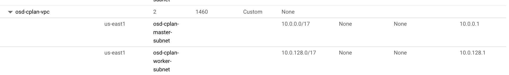
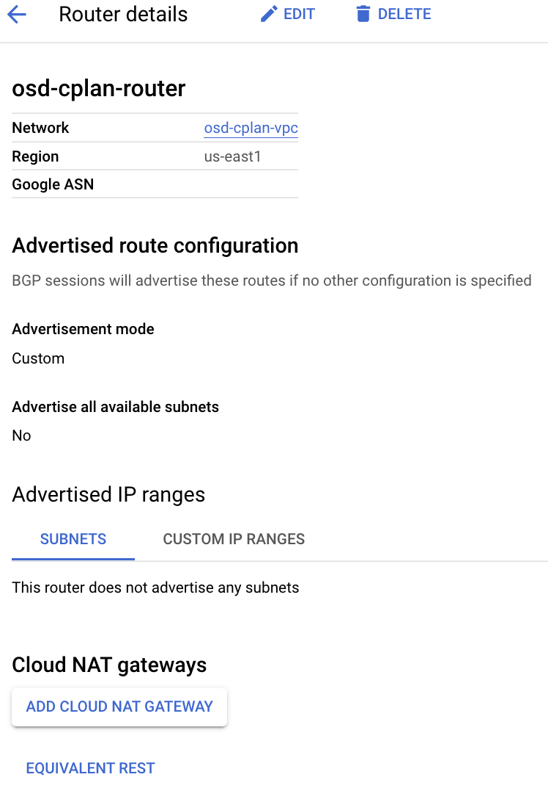
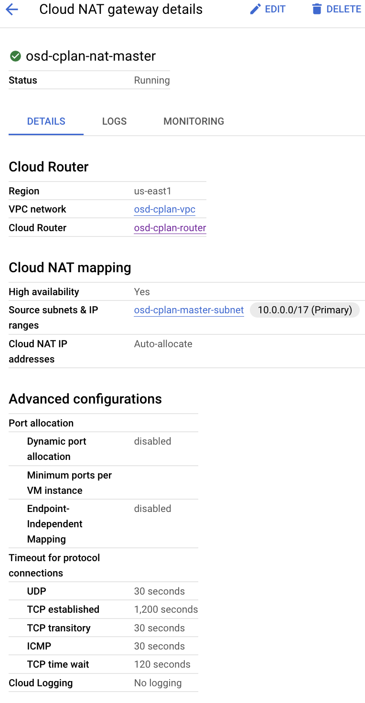
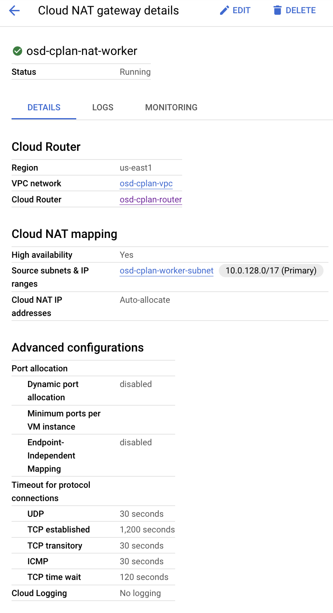
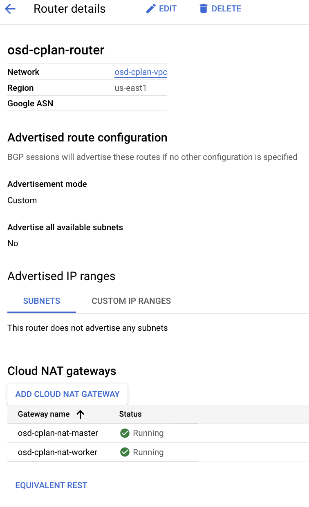

# Creating a OSD in GCP with Existing VPCs - CLI

**Roberto Carratalá, Andrea Bozzoni**

*Last updated 11/14/2022*

This is a guide to install OSD in GCP within Existing Virtual Private Clouds (VPCs) using CLI tools (gcloud CLI) or Terraform.

The guide will show all the steps to create all the networking prerequisites in GCP and then installing the OSD Cluster in GCP.

> **Tip** The official documentation for installing a OSD cluster in GCP can be found [here](https://docs.openshift.com/dedicated/osd_cluster_create/creating-a-gcp-cluster.html).

## Prerequisites

* [gcloud CLI](https://cloud.google.com/sdk/gcloud)
* [jq](https://stedolan.github.io/jq/download/)

NOTE: Also the GCloud Shell can be used, and have the gcloud cli among other tools preinstalled.

## Generate GCP VPC and Subnets

For deploy an OSD cluster in GCP using existing Virtual Private Cloud (VPC) you need to implement some prerequisites that you must create before starting the OpenShift Dedicated installation though the OCM.

This is a diagram showing the GCP infra prerequisites that are needed for the OSD installation:

{: width="750" }

You can use the gcloud CLI, to deploy the GCP VPC and subnets among other prerequisites for install the OSD in GCP.

As mentioned before, for deploy OSD in GCP using existing GCP VPC, you need to provide and create beforehand a GCP VPC and two subnets (one for the masters and another for the workers nodes).

1. Login and configure the proper GCP project where the OSD will be deployed:

   ```sh
   export PROJECT_NAME=<google project name>
   gcloud auth list
   gcloud config set project $PROJECT_NAME
   gcloud config list project
   ```

2. Export the names of the vpc and subnets:

   ```sh
   export REGION=<region name>
   export OSD_VPC=<vpc name>
   export MASTER_SUBNET=<master subnet name>
   export WORKER_SUBNET=<worker subnet name>
   ```

3. Create a custom mode VPC network:

   ```sh
   gcloud compute networks create $OSD_VPC --subnet-mode=custom
   gcloud compute networks describe $OSD_VPC
   ```

NOTE: we need to create the mode custom for the VPC network, because the auto mode generates automatically the subnets with IPv4 ranges with [predetermined set of ranges](https://cloud.google.com/vpc/docs/subnets#ip-ranges).

4. This example is using the standard configuration for these two subnets:

   ```md
   master-subnet - CIDR 10.0.0.0/17   - Gateway 10.0.0.1
   worker-subnet - CIDR 10.0.128.0/17 - Gateway 10.0.128.1
   ```

5. Create the GCP Subnets for the masters and workers within the previous GCP VPC network:

   ```sh
   gcloud compute networks subnets create $MASTER_SUBNET \
   --network=$OSD_VPC --range=10.0.0.0/17 --region=$REGION

   gcloud compute networks subnets create $WORKER_SUBNET \
   --network=$OSD_VPC --range=10.0.128.0/17 --region=$REGION
   ```

   {: width="750" }

6. Once the VPC and the two subnets are provided it is needed to create one [GCP Cloud Router](https://cloud.google.com/network-connectivity/docs/router/how-to/create-router-vpc-on-premises-network):

   ```sh
   export OSD_ROUTER=<router name>

   gcloud compute routers create $OSD_ROUTER \
   --project=$PROJECT_NAME --network=$OSD_VPC --region=$REGION
   ```

   {:style="display:block; margin-left:auto; margin-right:auto"}{: width="350" }

7. Then, we will deploy two [GCP Cloud NATs](https://cloud.google.com/nat/docs/set-up-manage-network-address-translation#gcloud) and attach them within the GCP Router:

    * Generate the GCP Cloud Nat for the Master Subnets:

    ```sh
    export NAT_MASTER=<master subnet name>

   gcloud compute routers nats create $NAT_MASTER \
   --region=$REGION                               \
   --router=$OSD_ROUTER                           \
   --auto-allocate-nat-external-ips               \
   --nat-custom-subnet-ip-ranges=$MASTER_SUBNET
    ```

   {:style="display:block; margin-left:auto; margin-right:auto"}{: width="350" }

    * Generate the GCP Cloud NAT for the Worker Subnets:

    ```sh
    export NAT_WORKER=<worker subnet name>

   gcloud compute routers nats create $NAT_WORKER \
       --region=$REGION                           \
       --router=$OSD_ROUTER                       \
       --auto-allocate-nat-external-ips           \
       --nat-custom-subnet-ip-ranges=$WORKER_SUBNET
   ```

   {:style="display:block; margin-left:auto; margin-right:auto"}{: width="350" }

8. As you can check the Cloud NATs GW are attached now to the Cloud Router:

   {:style="display:block; margin-left:auto; margin-right:auto"}{: width="350" }

## Install the OSD cluster using pre-existent VPCs using OCM-CLI

[OCM CLI](https://github.com/openshift-online/ocm-cli) is a command line tool that simplifies the use of the OCM API available at <https://api.openshift.com>.

1. Define the variables needed for the OSD in GCP cluster creation:

```bash
export CLUSTER_NAME=<cluster name>
export REGION=<region name>
export OSD_VPC=<vpc name>
export MASTER_SUBNET=<master subnet name>
export WORKER_SUBNET=<worker subnet name>
```

2. You need to generate a [GCP Service Account and generate a new key](https://cloud.google.com/sdk/docs/authorizing#authorize_with_a_service_account). Then download the json file and export the path where is located:

```bash
export GCP_SA_FILE=<location of the gcp sa json file>
```

> If the Service Account is generated beforehand (look for osd-ccs-admin service account), then you only need to generate a new key and download the json gcp Service Account file file.

3. Create the cluster using the OCM-CLI:

```bash
ocm create cluster $CLUSTER_NAME --provider gcp \
   --vpc-name $OSD_VPC --region $REGION         \
   --control-plane-subnet $MASTER_SUBNET        \ 
   --compute-subnet $WORKER_SUBNET              \
   --service-account-file $GCP_SA_FILE --ccs
```

4. Check the cluster status using OCM-CLI:

```bash
GCP_OSD_ID=$(ocm list clusters | grep $CLUSTER_NAME | awk '{ print $1 }')
ocm cluster status $GCP_OSD_ID
```

5. Enjoy your brand new OSD in GCP cluster!

## Automated Deploy OSD VPC and Subnets using Terraform

You can use also [automation code in Terraform](https://github.com/rh-mobb/tf-osd-gcp) to deploy all the GCP infrastructure required to deploy the OSD in preexistent VPCs and to deploy the OSD in GCP within the Preexistent VPCs.

* Clone the tf-osd-gcp repository:

```bash
git clone https://github.com/rh-mobb/tf-osd-gcp.git
cd tf-osd-gcp
```

* Copy and modify the tfvars file in order to custom to your scenario:

```bash
cp -pr terraform.tfvars.example terraform.tfvars
```

* Deploy the network infrastructure in GCP needed for deploy the OSD cluster:

```bash
make all
```

## Cleanup

For cleaning up the cluster you need to delete first the OSD cluster and then all the Network Prereqs that you've deployed.

### Using Gcloud CLI

1. Delete the OSD cluster using option 1 or option 2:

   * Option 1: Deleting the OSD cluster can be done using the OCM console described in the [official OSD docs](https://docs.openshift.com/dedicated/osd_install_access_delete_cluster/creating-a-gcp-cluster.html).

   * Option 2: Delete OSD from CLI:

   ```bash
   ocm delete cluster $GCP_OSD_ID
   ```

2. Deleting the GCP infrastructure resources (VPC, Subnets, Cloud NAT, Cloud Router).
Depending of which option you selected you must perform:

3. Delete GCP resources using GCloud CLI:

   ```sh
   gcloud compute routers nats delete $NAT_WORKER \
   --region=$REGION --router=$OSD_ROUTER --quiet

   gcloud compute routers nats delete $NAT_MASTER \
   --region=$REGION --router=$OSD_ROUTER --quiet

   gcloud compute routers delete $OSD_ROUTER --region=$REGION --quiet

   gcloud compute networks subnets delete $MASTER_SUBNET --region=$REGION --quiet
   gcloud compute networks subnets delete $WORKER_SUBNET --region=$REGION --quiet

   gcloud compute networks delete $OSD_VPC --quiet
   ```

### Using Terraform

1. Delete GCP resources using Terraform:

   ```sh
   make destroy
   ```
