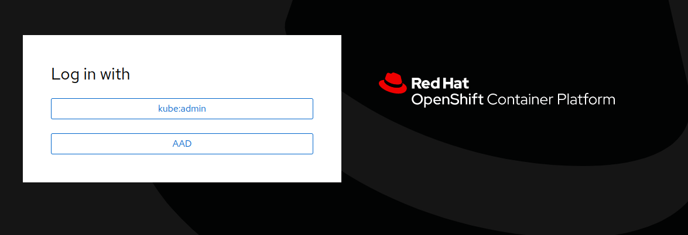
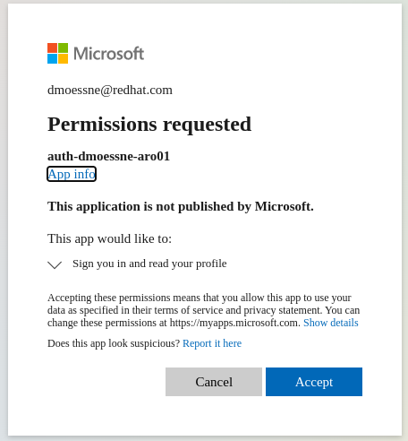

# Configure Azure AD as an OIDC identity provider for ARO with cli  #

**Daniel Moessner**

*26 June 2022*

The steps to add Azure AD as an identity provider for Azure Red Hat OpenShift (ARO) via cli are:

   * [Prerequisites](#prerewuisites)
      * [Have Azure cli installed](#have-azure-cli-installed)
      * [Login to Azure](#login-to-azure)
   * [Azure](#azure)
      * [Define needed variables](#define-needed-variables)
      * [Get oauthCallbackURL](#get-oauthcallbackurl)
      * [Create manifest.json file to configure the Azure Active Directory application](#create-manifestjson-file-to-configure-the-azure-active-directory-application)
      * [Register/create app](#registercreate-app)
      * [Add Servive Principal for the new app](#add-servive-principal-for-the-new-app)
      * [Make Service Principal an Enterprise Application](#make-service-principal-and-enterprise-application)
      * [Create the client secret](#create-the-client-secret)
      * [Update the Azure AD application scope permissions](#update-the-azure-ad-application-scope-permissions)
      * [Get Tenant ID](#get-tenant-id)
   * [OpenShift](#openshift)
      * [Login to OpenShift as kubeadmin](#login-to-openshift-as-kubeadmin)
      * [Create an OpenShift](#create-an-openshift)
      * [Apply OpenShift OpenID authentication](#apply-openshift-openid-authentication)
      * [Wait for authentication operator to roll out](#wait-for-authentication-operator-to-roll-out)
      * [Verify login through Azure Active Directory](#verify-login-through-azure-active-directory)
      * [Last steps](#last-steps)

## Prerequisites ##
### Have Azure cli installed ###
Follow the Microsoft instuctions: https://docs.microsoft.com/en-us/cli/azure/install-azure-cli

> **Note**
> This has been written for az cli verion `2.37.0` some commands will not work with previous versions, however, there is a known issue https://github.com/Azure/azure-cli/issues/23027 where we will use an older version via `podman run -it mcr.microsoft.com/azure-cli:2.36.0` . 
> In case you're using `docker`, just replace `podman` command by `docker` . 
> For podman installation on  Mac, Windows & Linux, please refer to https://podman.io/getting-started/installation

### Login to Azure ###

Login to Azure as follows:

   ```
   az login
   ```

If you're logging in from a system you have no access to your browser you can authenticate, you can also use

   ```
   az login --use-device-code
   ``` 
## Azure ##
### Define needed variables ###
To simplly follow along, first define the following variables according to your set-up:

   ```
   RESOURCEGROUP=<cluster-dmoessne-aro01> # replave with your name
   CLUSTERNAME=<rg-dmoessne-aro01>  # replave with your name
   ```

### Get oauthCallbackURL ###
To get the `oauthCallbackURL` for the Azure AD integration, run the following commands:
   ```
   DOMAIN=$(az aro show -g $RESOURCEGROUP -n $CLUSTERNAME --query clusterProfile.domain -o tsv)
   APISERVER=$(az aro show -g $RESOURCEGROUP -n $CLUSTERNAME --query apiserverProfile.url -o tsv)

   oauthCallbackURL=https://oauth-openshift.apps.$DOMAIN/oauth2callback/AAD
   echo $oauthCallbackURL
   ```
> **Note** 
`oauthCallbackURL`, in particular `AAD` can be changed but **must** match the name in the oauth providerwhen creating the OpenShift OpenID authentication   

### Create `manifest.json` file to configure the Azure Active Directory application ###
Configure OpenShift to use the `email` claim and fall back to `upn` to set the Preferred Username by adding the `upn` as part of the ID token returned by Azure Active Directory.

Create a `manifest.json` file to configure the Azure Active Directory application.

   ```
   cat << EOF > manifest.json
   {
    "idToken": [
      {
       "name": "upn",
       "source": null,
       "essential": false,
       "additionalProperties": []
      },
      {
       "name": "email",
       "source": null,
       "essential": false,
       "additionalProperties": []
      }
     ]
   }  
   EOF
   ```


### Register/create app ###
Create an Azure AD application and retrieve app id:

   ```
   DISPLAYNAME=<auth-dmoessne-aro01> # set you name accordingly 

   az ad app create \
   --display-name $DISPLAYNAME \
   --web-redirect-uris $oauthCallbackURL \
   --sign-in-audience AzureADMyOrg \
   --optional-claims @manifest.json
   ```

   ```
   APPID=$(az ad app list --display-name $DISPLAYNAME --query [].appId -o tsv)
   ```

### Add Servive Principal for the new app ###
Create Pervice Principal for the app created:

   ```
   az ad sp create --id $APPID
   ```

### Make Service Principal an Enterprise Application ###
We need this Service Principal to be an Enterprise Application to be able to add users and groups, so we add the needed tag

   ```
   az ad sp update --id $APPID --add tags WindowsAzureActiveDirectoryIntegratedApp
   ```
> **Note** 
> In case you get a trace back (az cli >= `2.37.0`) check out https://github.com/Azure/azure-cli/issues/23027
> To overcome that issue until fixed, we'll do the following
> ```
> podman run -it mcr.microsoft.com/azure-cli:2.36.0
> az login
> DISPLAYNAME=<auth-dmoessne-aro01> # Replave with the name given before
> APPID=$(az ad app list --display-name $DISPLAYNAME --query [].appId -o tsv)
> az ad sp update --id $APPID --add tags WindowsAzureActiveDirectoryIntegratedApp
> exit
>```

### Create the client secret ###
The password for the app created is retrieved by resetting the same:

   ```
   PASSWD=$(az ad app credential reset --id $APPID --query password -o tsv)
   ``` 

### Update the Azure AD application scope permissions ###
To be able to read the user information from Azure Active Directory, we need to add the following Azure Active Directory Graph permissions

Add permission for the Azure Active Directory as follows:

   * read email
   ```
   az ad app permission add \
   --api 00000003-0000-0000-c000-000000000000 \
   --api-permissions 64a6cdd6-aab1-4aaf-94b8-3cc8405e90d0=Scope \
   --id $APPID
   ```

   * read profile
   ```
   az ad app permission add \
   --api 00000003-0000-0000-c000-000000000000 \
   --api-permissions 14dad69e-099b-42c9-810b-d002981feec1=Scope \
   --id $APPID
   ```

   * User.Read
   ```
   az ad app permission add \
   --api 00000003-0000-0000-c000-000000000000 \
   --api-permissions e1fe6dd8-ba31-4d61-89e7-88639da4683d=Scope \
   --id $APPID
   ```
> **Note**
> If you see message to grant the consent unless you are authenticated as a Global Administrator for this Azure Active Directory. Standard domain users will be asked to grant consent when they first login to the cluster using their AAD credentials.

### Get Tenant ID ###
We do need the Tenant ID for setting up the Oauth provider later on:

   ```
   TENANTID=$(az account show --query tenantId -o tsv)
   ```
> **Note**
> Now we can switch over to our OpenShift installation and apply the needed configuraion.
> Please refer to https://docs.openshift.com/container-platform/latest/cli_reference/openshift_cli/getting-started-cli.html to get the latest `oc` cli
## OpenShift ##
### Login to OpenShift as kubeadmin ###
Fetch kubeadmin password and login to your cluster via `oc` cli (you can use any other cluster-admin user in case you have already created/added other oauth providers)

   ```
   KUBEPW=$(az aro list-credentials \
   --name $CLUSTERNAME \
   --resource-group $RESOURCEGROUP \
   --query kubeadminPassword --output tsv)

   oc login $APISERVER -u kubeadmin -p $KUBEPW
   ``` 
### Create an OpenShift ###
Create an OpenShift secret to store the Azure Active Directory application secret from the application password we created/reset earlier:

   ```
   oc create secret generic openid-client-secret-azuread \
   -n openshift-config \
   --from-literal=clientSecret=$PASSWD
   ```


### Apply OpenShift OpenID authentication ###
As a last step we need to apply the OpenShift OpenID authentication for Azure Active Directory:

   ```
   cat << EOF | oc apply -f -
   apiVersion: config.openshift.io/v1
   kind: OAuth
   metadata:
     name: cluster
   spec:
     identityProviders:
     - name: AAD
       mappingMethod: claim
       type: OpenID
       openID:
         clientID: $APPID
         clientSecret:
           name: openid-client-secret-azuread
         extraScopes:
         - email
         - profile
         extraAuthorizeParameters:
           include_granted_scopes: "true"
         claims:
           preferredUsername:
           - email
           - upn
           name:
           - name
           email:
           - email
         issuer: https://login.microsoftonline.com/$TENANTID
   EOF
   ```

### Wait for authentication operator to roll out ###
Before we move over to the OpenShift login, let's wait for the new version of the authentication cluster operator to be rolled out


   ```
   watch -n 5 oc get co authentication
   ```

> **Note**
> it may take some time until the rollout starts 

### Verify login through Azure Active Directory ###
Get console url to login:

   ```
   az aro show --name $CLUSTERNAME --resource-group $RESOURCEGROUP --query "consoleProfile.url" -o tsv
   ```

Opening the url in a browser, we can see the login to Azure AD is available

   

At first login you may have to accept application permissions

   

### Last steps ###
As a last step you may want to grant a user or group cluster-admin permissions and remove kubeadmin user, see
- https://docs.openshift.com/container-platform/4.10/authentication/using-rbac.html#cluster-role-binding-commands_using-rbac
- https://docs.openshift.com/container-platform/4.10/authentication/remove-kubeadmin.html
