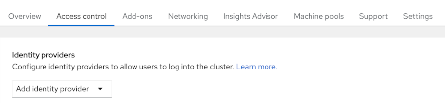
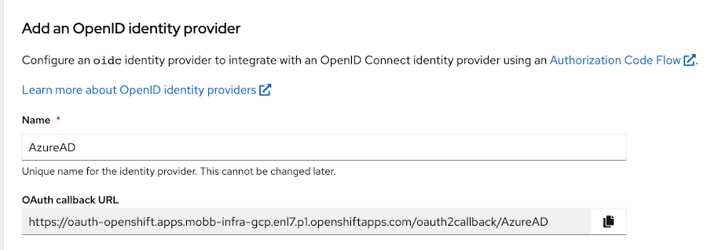
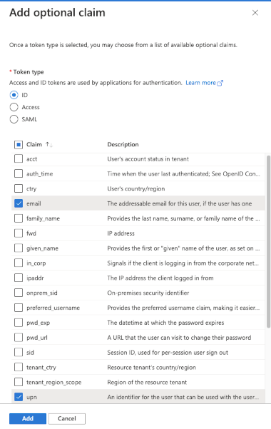
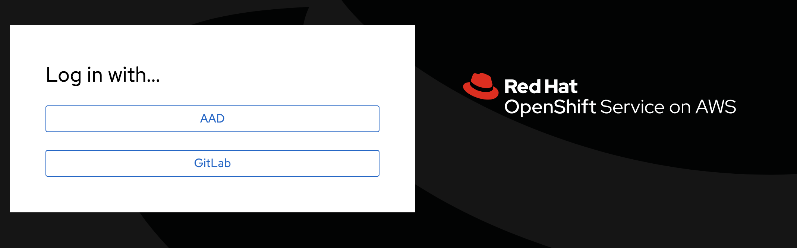

# Configure Azure AD ad OIDC identity provider #

The steps to add Azure AD as an identity provider for managed OpenShift are:

1. Determine the OAuth callback URL
1. A new App registration on Azure AD
1. Creation of a client secret
1. The Token configuration 
1. Configuration of the OAuth identity provider in OCM

## Determine the OAuth callback URL ##
To determine the OAuth callback URL there are different ways. 

The callback URL has the following format:
```
https://oauth-openshift.apps.<cluster_name>.<cluster_domain>/oauth2callback/<idp_provider_name>
```
You can determine it for your cluster by changing the <cluster_name> and the <cluster_domain> with the name of your cluster and its domain.
The <idp_provider_name> is the name that you give to the identity provider.

It is possible to find quickly the callback URL in the OCM:
1. Select your cluster in OCM and then go to the **'Access control'** tab. 

1. Then select OpenID as identity provider from the identity providers list.  

1. Give a name to the indenity provider that we are adding to the OCP cluster

1. Keep the OAuth callback URL to use later.

## A new App registrations on Azure AD ##
Access your Azure account and select the Azure Active Directory service and execute the following steps:

1. From the main menu add a new Webapp  

1. For the new webapp select a name and the supported account type
1. In the redirect URI add the callback URL saved in the previous section and press the button 'Register'  
  
 Once the Webapp is created the following field must be saved to be used in the OCM OAuth configuration:
    - Application (client) ID
    - Directory (tenant) ID   

     

## Creation of a client secret ##
1. Create a new Secret for the Webapp  
   
Once the secret is created the SecretID has to be saved to be used later in the OCM OAuth configuration 


## The Token configuration  ##
1. Create a new token configuration  

1. Add the minimum claims that has to be in the token:
    - upn
    - email
       
   
1. Specify that the claim must be returned in the token.  


## Configuration the OAuth identity provider in OCM ##
In the OCM fill all the fields with the values collected during the registration of the new Webapp in the Azure AD  

and click the 'Add' button. 
After a few minutes the Azure AD authentication methos will be available in the OpenShift console login screen  

