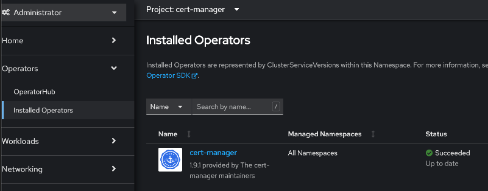
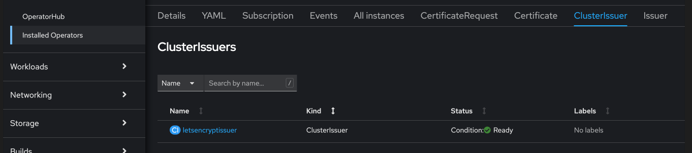
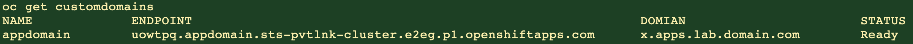
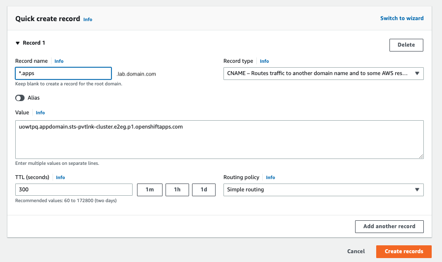

# Dynamic Certificates for ROSA Custom Domain

There're users who prefer not to use wild-card certificates. This ROSA guide talks about certificate management with cert-manager and letsencrypt, to dynamically issue certificates to routes created on a custom domain that's hosted on AWS Route53.

## Table of Contents

* Do not remove this line (it will not be displayed)
{:toc}

## Prerequisites

* A Red Hat OpenShift on AWS (ROSA) cluster
* The oc CLI      #logged in.
* The aws CLI     #logged in.
* The rosa CLI    #logged in.
* jq
* gettext
* A Public Route53 Hosted Zone, and the related Domain to use.


## Set up environment

1. Export few environment variables

   ```bash
   export CLUSTER_NAME="sts-pvtlnk-cluster"
   export OIDC_PROVIDER=$(oc get authentication.config.openshift.io cluster -o json \
   | jq -r .spec.serviceAccountIssuer| sed -e "s/^https:\/\///")
   export AWS_ACCOUNT_ID=$(aws sts get-caller-identity --query Account --output text)
   export SCRATCH_DIR=/tmp/scratch
   export AWS_PAGER=""
   export LETSENCRYPT_EMAIL=youremail@work.com
   export HOSTED_ZONE_ID=ABCDEFGHEXAMPLE
   export HOSTED_ZONE_REGION=us-east-2
   export DOMAIN=lab.domain.com   #Custom Hosted Zone Domain for apps
   mkdir -p $SCRATCH_DIR
   ```

2. Install jq & gettext

    Installing or ensuring the gettext & jq package is installed, will allow us to use envsubst to simplify some of our configuration so we can use output of CLI commands as input into YAMLs to reduce the complexity of manual editing.

   ```bash
   brew install gettext jq
   # or, for Linux / Windows WSL
   #sudo dnf install gettext jq
   ```


## Prepare AWS Account

In order to make changes to the AWS Route53 Hosted Zone to add/remove DNS TXT challenge records by the cert-manager pod, we first need to create an IAM role with specific policy permissions & a trust relationship to allow access to the pod.

1. Prepare an IAM Policy file

   ```json
   cat <<EOF > $SCRATCH_DIR/cert-manager-r53-policy.json
   {
     "Version": "2012-10-17",
     "Statement": [
       {
         "Effect": "Allow",
         "Action": "route53:GetChange",
         "Resource": "arn:aws:route53:::change/*"
       },
       {
         "Effect": "Allow",
         "Action": [
           "route53:ChangeResourceRecordSets",
           "route53:ListResourceRecordSets"
         ],
         "Resource": "arn:aws:route53:::hostedzone/*"
       },
       {
         "Effect": "Allow",
         "Action": "route53:ListHostedZonesByName",
         "Resource": "*"
       }
     ]
   }
   EOF
   ```


2. Create the IAM Policy using the above created file. 

   > This creates a named policy for the cluster, you could use a generic policy for multiple clusters to keep things simpler.

   ```bash
   POLICY=$(aws iam create-policy --policy-name "${CLUSTER_NAME}-cert-manager-r53-policy" \
      --policy-document file://$SCRATCH_DIR/cert-manager-r53-policy.json \
      --query 'Policy.Arn' --output text) || \
   echo $POLICY
   ```

3. Create a Trust Policy

   ```json
   cat <<EOF > $SCRATCH_DIR/TrustPolicy.json
   {
     "Version": "2012-10-17",
     "Statement": [
       {
         "Effect": "Allow",
         "Principal": {
           "Federated": "arn:aws:iam::${AWS_ACCOUNT_ID}:oidc-provider/${OIDC_PROVIDER}"
         },
         "Action": "sts:AssumeRoleWithWebIdentity",
         "Condition": {
           "StringEquals": {
             "${OIDC_PROVIDER}:sub": [
               "system:serviceaccount:cert-manager:cert-manager"
             ]
           }
         }
       }
     ]
   }
   EOF
   ```

4. Create an IAM Role for the cert-manager Operator, with the above trust policy.

   ```bash
   ROLE=$(aws iam create-role \
     --role-name "${CLUSTER_NAME}-cert-manager-operator" \
     --assume-role-policy-document file://$SCRATCH_DIR/TrustPolicy.json \
     --query "Role.Arn" --output text)
   echo $ROLE
   ```

5. Attach the permissions policy to the Role

   ```bash
   aws iam attach-role-policy \
      --role-name "${CLUSTER_NAME}-cert-manager-operator" \
      --policy-arn $POLICY
   ```

## Set up cert-manager

1. Create a project (namespace) in the ROSA cluster.

   ```bash
   oc new-project cert-manager --display-name="Certificate Manager" --description="Project contains Certificates and Custom Domain related components."
   ```
2. Install the cert-manager Operator

   ```yaml
   cat <<EOF | oc create -f -
   apiVersion: operators.coreos.com/v1
   kind: OperatorGroup
   metadata:
     generateName: cert-manager-
     namespace: cert-manager
   ---
   apiVersion: operators.coreos.com/v1alpha1
   kind: Subscription
   metadata:
     name: cert-manager
     namespace: cert-manager
   spec:
     channel: stable
     installPlanApproval: Automatic
     name: cert-manager
     source: community-operators
     sourceNamespace: openshift-marketplace
   EOF
   ```
   > *It will take a few minutes for this operator to install and complete its set up.*

3. Wait for cert-manager operator to finish installing.

   Our next steps depends on the successful installation of the operator. I recommend that you login to your cluster console to confirm the succeess status of cert-manager operator, in the Installed Operators section.

   


4. Annotate the ServiceAccount.

This is to enable the AWS SDK client code running within the cert-manager pod to interact with AWS STS service for temporary tokens, by assuming the IAM Role that was created in an earlier step. This is referred to as [IRSA](https://docs.aws.amazon.com/eks/latest/userguide/iam-roles-for-service-accounts.html). 

   ```bash
   oc annotate serviceaccount cert-manager -n cert-manager eks.amazonaws.com/role-arn=$ROLE
   ```
   > *Normally, after ServiceAccount annotations, a restart of the pod is required. However, the next step will automatically cause a restart of the pod.* 

5. Update the CA truststore of the cert-manager pod.

This step is usually not required. However, it was noticed that the cert-manager pod had difficulties in trusting the [STS](sts.amazonaws.com) & [LetsEncrypt](acme-v02.api.letsencrypt.org) endpoints. So the below commands essentially downloads the CA chain of these endpoints, puts them into a ConfigMap, which then gets attached to the pod as a Volume.
Along with this step, I'll also be [setting the NameServers that the cert-manager will use for DNS01 self-check](https://cert-manager.io/docs/configuration/acme/dns01/#setting-nameservers-for-dns01-self-check) 
The Volume attachment to the pod and the setting of NameServers will be done together by patching the cert-manager CSV resource to persist these changes to the cert-manager deployment. This will cause the rollout of a new deployment and restart of the cert-manager pod.

   ```bash
   openssl s_client -showcerts -verify 5 -connect sts.amazonaws.com:443 < /dev/null 2> /dev/null | awk '/BEGIN/,/END/{ if(/BEGIN/){a++}; print}'  > $SCRATCH_DIR/extra-ca.pem
   openssl s_client -showcerts -verify 5 -connect acme-v02.api.letsencrypt.org:443 < /dev/null 2> /dev/null | awk '/BEGIN/,/END/{ if(/BEGIN/){a++}; print}'  >> $SCRATCH_DIR/extra-ca.pem

   oc create configmap extra-ca --from-file=$SCRATCH_DIR/extra-ca.pem -n cert-manager

   CERT_MANAGER_CSV_NAME=$(oc get csv | grep 'cert-manager' | awk '{print $1}')
   CLUSTER_DNS_SERVICE_IP=$(oc get svc -n openshift-dns | grep 'dns-default' | awk '{print $3}')
   echo $CERT_MANAGER_CSV_NAME
   echo $CLUSTER_DNS_SERVICE_IP
   ```
   ```bash
   oc patch csv $CERT_MANAGER_CSV_NAME --type='json' -p '[{"op": "add", "path": "/spec/install/spec/deployments/0/spec/template/spec/containers/0/args/-", "value":'--dns01-recursive-nameservers-only'}, {"op": "add", "path": "/spec/install/spec/deployments/0/spec/template/spec/containers/0/args/-", "value":'--dns01-recursive-nameservers=$CLUSTER_DNS_SERVICE_IP:53'}]'

   oc patch csv $CERT_MANAGER_CSV_NAME --type='json' -p '[{"op": "add", "path": "/spec/install/spec/deployments/0/spec/template/spec/volumes", "value": [{"name": "extra-ca"}]}, {"op": "add", "path": "/spec/install/spec/deployments/0/spec/template/spec/volumes/0/configMap", "value": {"name": "extra-ca", "defaultMode": 420}}, {"op": "add", "path": "/spec/install/spec/deployments/0/spec/template/spec/containers/0/volumeMounts", "value": [{"name": "extra-ca", "mountPath": "/etc/ssl/certs/extra-ca-bundle.pem", "readOnly": true, "subPath": "extra-ca-bundle.pem"}]}]'
   ```


## Create the Issuer and the Certficiate

### Configure Certificate Requestor

3. Create Cluster Issuer to use Let's Encrypt 

   ```yaml
   envsubst  <<EOF | oc apply -f -
   apiVersion: cert-manager.io/v1
   kind: ClusterIssuer
   metadata:
     name: letsencryptissuer
   spec:
     acme:
       server: https://acme-v02.api.letsencrypt.org/directory
       email: $LETSENCRYPT_EMAIL
       # This key doesn't exist, cert-manager creates it
       privateKeySecretRef:
         name: prod-letsencrypt-issuer-account-key
       solvers:
       - dns01:
           route53:
            hostedZoneID: $HOSTED_ZONE_ID
            region: $HOSTED_ZONE_REGION
            secretAccessKeySecretRef:
              name: ''
   EOF
   ```

4. Describe the ClusterIssuer to confirm it's ready.

   ```bash
   oc describe clusterissuer letsencryptissuer
   ```

   You should see an output that mentions that the issuer is Registered/Ready

   ```
   Conditions:
    Last Transition Time:  2022-11-17T10:29:37Z
    Message:               The ACME account was registered with the ACME server
    Observed Generation:   1
    Reason:                ACMEAccountRegistered
    Status:                True
    Type:                  Ready
   Events:                 <none>
   ```

   Once the above command is complete, the status of the ClusterIssues in the cluster console will look similar to the below screenshot.  

   
  
### Create the Certificate, which will later be used by the Custom Domain.

   > *I've used a SAN certificate here to show how SAN certificates could be created, which will be useful for clusters intended to run only a fixed set of applications. However, this is optional; a single subject/domain certificate works too*

1. Configure the Certificate

   ```yaml
   envsubst  <<EOF | oc apply -f -
   apiVersion: cert-manager.io/v1
   kind: Certificate
   metadata:
     name: customdomain-cert
     namespace: cert-manager
   spec:
     secretName: custom-domain-certificate-tls
     issuerRef:
        name: letsencryptissuer
        kind: ClusterIssuer
     commonName: "x.apps.$DOMAIN"
     dnsNames:
     - "x.apps.$DOMAIN"
     - "y.apps.$DOMAIN"
     - "z.apps.$DOMAIN"
   EOF
   ```

2. View the Certificate status

   It'll take upto 5 minutes for the Certificate to show as Ready status. If it takes too long, the oc describe command will mention issues if any.

   ```bash
   oc get certificate customdomain-cert -n cert-manager
   oc describe certificate customdomain-cert -n cert-manager
   ```

## Create the Custom Domain, which will be used to access your applications.

1. Create the Custom Domain

   ```yaml
   envsubst  <<EOF | oc apply -f -
   apiVersion: managed.openshift.io/v1alpha1
   kind: CustomDomain
   metadata:
     name: appdomain
   spec:
     domain: x.apps.$DOMAIN
     certificate:
       name: custom-domain-certificate-tls
       namespace: cert-manager 
     scope: Internal
   EOF
   ```

2. View the status of the Custom Domain

   ```bash
   oc get customdomain appdomain -n cert-manager
   ```
   > *It will take 2-3 minutes for the custom domain to change from NotReady to Ready status. When ready, an endpoint also will be visible in the output of the above command, as shown below*



1. Next, we need to add a DNS record in my Custom Domain Route53 Hosted Zone to CNAME the  the wildcard applications domain to the above obtained endpoint, as shown below.



   ```bash
   CUSTOM_DOMAIN_ENDPOINT=$(oc get customdomain appdomain -n cert-manager | grep 'appdomain' | awk '{print $2}')
   echo $CUSTOM_DOMAIN_ENDPOINT
   ```
   ```json
   cat <<EOF > $SCRATCH_DIR/add_cname_record.json
   {
	   "Comment":"Add apps CNAME to Custom Domain Endpoint",
	   "Changes":[{
          "Action":"CREATE",
          "ResourceRecordSet":{
		       "Name": "*.apps.$DOMAIN",
			   "Type":"CNAME",
			   "TTL":30, 
			   "ResourceRecords":[{
				   "Value": "$CUSTOM_DOMAIN_ENDPOINT"
			   }]
		   }
	   }]
   }   
   EOF
   ```
   ```bash
   aws route53 change-resource-record-sets --hosted-zone-id $HOSTED_ZONE_ID --change-batch file://$SCRATCH_DIR/add_cname_record.json
   ```
   > *The wild card CNAME'ing avoids the need to create a new record for every new application. The certificate that each of these applications use will NOT be a wildcard certificate* 


   At this stage, you will be able to expose cluster applications on any of the listed DNS names that were specified in the previously created Certificate. But what if you have many more applications that will need to be securely exposed too. Well, one approach is to keep updating the Certificate resource with additional SAN names as more applications prepare to get onboarded, and this Certificate update which will trigger an update to the Custom Domain to honor the newly added SAN names. Another approach is to dynamically issue a Certificate to every new Route; Read on to find the details about this latter approach. 

## Dynamic Certificates for Custom Domain Routes.

1. Create OpenShift resources required for issuing Dynamic Certificates to Routes.

This step will create a new deployment (and hence a pod) that'll watch out for specifically annotated routes in the cluster, and if the issuer-kind and issuer-name annotations are found in a new route, it'll request the Issuer (ClusterIssuer in my case) for a new Certificate that's unique to this route and which'll honor the hostname that was specified while creating the route.

   ```bash
   oc apply -f https://github.com/cert-manager/openshift-routes/releases/latest/download/cert-manager-openshift-routes.yaml -n cert-manager
   ```
   > *Additonal OpenShift resources such as a ClusterRole (with permissions to watch and update the routes across the cluster), a ServiceAccount (with these permissions, that will be used to run this newly created pod) and a ClusterRoleBinding to bind these two resources, will be created in this step too.* 
   > *If the cluster does not have access to github, you may as well locally save the raw contents of the above yaml, and run oc apply -f localfilename.yaml -n cert-manager* 

2. View the status of the new pod.

Check if all the pods are running successfully and that the events do not mention any errors.

   ```bash
   oc get po -n cert-manager
   ```

## Test an application.

1. Create a test applciation in a new namespace.

   ```bash
   oc new-project testapp
   oc new-app --docker-image=docker.io/openshift/hello-openshift -n testapp
   ```

2. Expose the test application Service.

Let's create a Route to expose the application from outside the cluster, and annotate the Route to give it a new Certificate.

   ```bash
   oc create route edge --service=hello-openshift testroute --hostname hello.apps.$DOMAIN -n testapp
   oc annotate route testroute -n testapp cert-manager.io/issuer-kind=ClusterIssuer cert-manager.io/issuer-name=letsencryptissuer
   ```

   > *It will take a 2-3 minutes for the Certificate to be created.* 

3. Access the application Route.

Do a curl test (or any http client of your preference) to confirm there are no certificate related errors. 
   > *Output should print "Hello OpenShfit!", and you should also notice a line that says "subjectAltName: host hello.apps.$DOMIAN" matched cert's "hello.apps.$DOMIAN"*

   ```bash
   curl -vv https://hello.apps.$DOMAIN
   ```


## Debugging

Please note that while creating certificates, the validation process usually take upto 2-3 minutes to complete.

If you face issues during certificate create step, run 'oc describe' against each of - 'certificate,certificaterequest,order & challenge' resources to view the events/reasons that'll mostly help with identifying the cause of the issue.

```bash
oc get certificate,certificaterequest,order,challenge
```

This is a very [helpful guide in debugging certificates](https://cert-manager.io/docs/faq/acme/) as well.

You may also use the [cmctl](https://cert-manager.io/docs/reference/cmctl/) CLI tool for various certificate management activities such as to check the status of certificates, testing renewals etc.