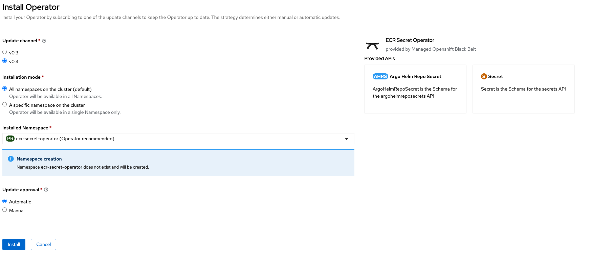
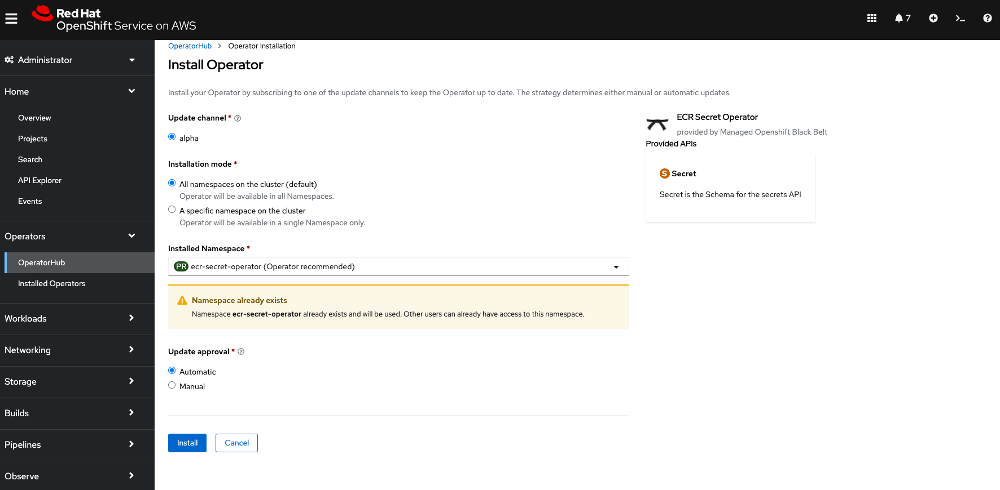
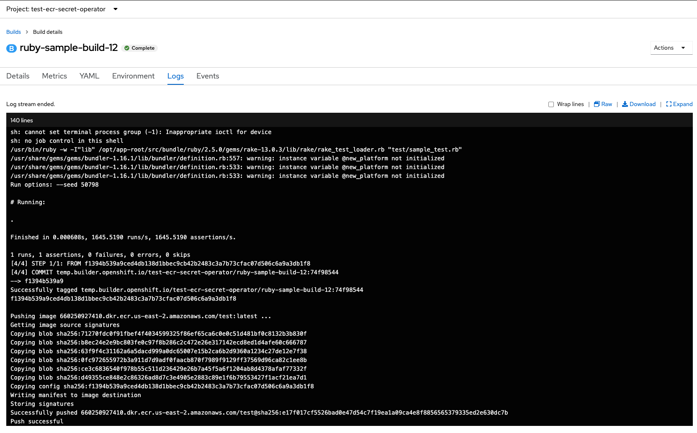

# ECR Secret Operator

Amazon Elastic Container Registry [Private Registry Authentication](https://docs.aws.amazon.com/AmazonECR/latest/userguide/registry_auth.html) provides a temporary token that is valid only for 12 hours. It is a challenge for automating container image build process to refresh the token or secret in a timely manner.

This operators frequently talks with AWS ECR GetAuthroization Token and create/update the secret, so that the service account can perform docker image build.


## How to use this operator

### Prerequisites

* [Create an ECR private repository](https://docs.aws.amazon.com/AmazonECR/latest/userguide/repository-create.html)
* Provide AWS Authentication to the operator. Two Options:
  * [IAM User](./iam_user.md)
  * [STS Assume Role](./iam_assume_role.md)

### Install the operator

* Install the operator from operator hub community 




### Create the ECR Secret CRD

```bash
echo << EOF | oc apply -f -
apiVersion: ecr.mobb.redhat.com/v1alpha1
kind: Secret
metadata:
  name: ecr-secret
  namespace: test-ecr-secret-operator
spec:
  generated_secret_name: ecr-docker-secret
  ecr_registry: [ACCOUNT_ID].dkr.ecr.us-east-2.amazonaws.com
  frequency: 10h
  region: us-east-2
EOF
```

A docker registry secret is created by the operator momentally and the token is patched every 10 hours

```
oc get secret ecr-docker-secret   
NAME                TYPE                             DATA   AGE
ecr-docker-secret   kubernetes.io/dockerconfigjson   1      16h
```

### A sample build process with generated secret


Link the secret to builder

```
oc secrets link builder ecr-docker-secret 
```

Configure build config to point to your ECR Container repository

```bash
oc create imagestream ruby
oc tag openshift/ruby:2.5-ubi8 ruby:2.5
echo << EOF | oc apply -f -
kind: BuildConfig
apiVersion: build.openshift.io/v1
metadata:
  name: ruby-sample-build 
  namespace: test-ecr-secret-operator
spec:
  runPolicy: Serial 
  source: 
    git:
      uri: "https://github.com/openshift/ruby-hello-world"
  strategy: 
    sourceStrategy:
      from:
        kind: "ImageStreamTag"
        name: "ruby:2.5"
      incremental: true
  output: 
    to:
      kind: "DockerImage"
      name: "[ACCOUNT_ID].dkr.ecr.us-east-2.amazonaws.com/test:latest"
  postCommit: 
      script: "bundle exec rake test"
EOF 
oc start-build ruby-sample-build --wait
```

Build should succeed and push the image to the the private ECR Container repository


