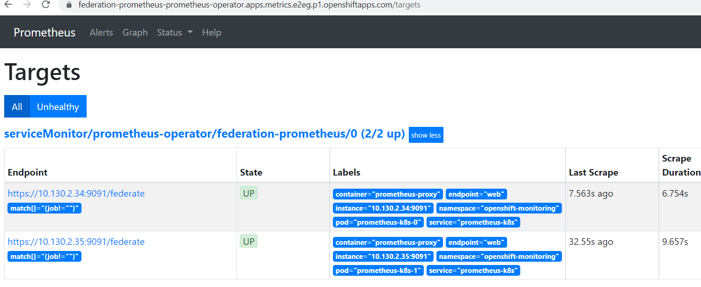
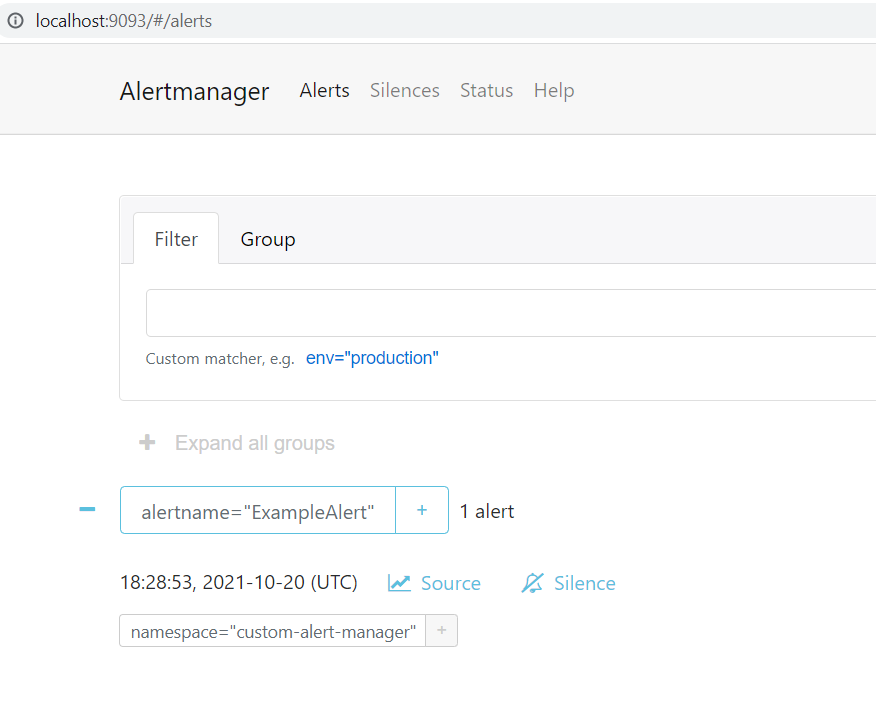

# Federating Metrics to a centralized Prometheus Cluster

Red Hat Openshift for AWS (ROSA) comes with two built-in monitoring stacks. `ClusterMonitoring` and `User Workload Monitoring`. They are both based on Prometheus, the first targets the Cluster Operator (Red Hat SRE) and the latter targets the Cluster user (you!).

Both provide amazing metrics insights inside the Cluster's web console, showing overall cluster metrics as well as namespace specific workload metrics, all integrated with your configured IDP.

However the Alert Manager instance is locked down and used to send alerts to the Red Hat  SRE team. This means that the customer cannot create alerts for either the cluster resources, or their own workloads. This is being worked on and future versions of ROSA will provide a way for the end user to create alerts for their own workloads.

Until that work is done, the ROSA cluster administrator can deploy a Prometheus instance and configure it to send alerts to themselves. Thankfully with Prometheus' federated metrics feature and the Prometheus Operator, this can be done in a few simple steps.

This guide is heavily influenced by Tommer Amber's [guide](https://medium.com/@tamber/2-mini-how-to-guides-for-prometheus-on-openshift-federation-custom-infrastructure-alerting-8ec70061405d) for OCP 4.x.

## Pre-requisites

* [AWS CLI](https://docs.aws.amazon.com/cli/latest/userguide/cli-chap-install.html)
* [jq](https://stedolan.github.io/jq/)
* htpasswd
* A Red Hat OpenShift for AWS (ROSA) cluster 4.8 or higher

## Environment Variables

Before we get started we need to set some environment variables to be used throughout the guide.

```bash
export PROM_NAMESPACE=federated-metrics
export PROM_PASS=$(head /dev/urandom | tr -dc A-Za-z0-9 | head -c43)
export PROM_HTPASS=$(htpasswd -s -b -n internal $PROM_PASS)
export SESSION_SECRET=$(head /dev/urandom | tr -dc A-Za-z0-9 | head -c43)
```

## Install Prometheus Operator

> If you prefer you can do this from the Operator Hub in the cluster console itself.

### Create a OperatorGroup and Subscription for the Prometheus Operator

```bash
cat << EOF | kubectl apply -f -
---
apiVersion: v1
kind: Namespace
metadata:
  name: ${PROM_NAMESPACE}
---
apiVersion: operators.coreos.com/v1
kind: OperatorGroup
metadata:
  name: federated-metrics
  namespace: ${PROM_NAMESPACE}
spec:
  targetNamespaces:
  - ${PROM_NAMESPACE}
---
apiVersion: operators.coreos.com/v1alpha1
kind: Subscription
metadata:
  name: prometheus
  namespace: ${PROM_NAMESPACE}
spec:
  channel: beta
  installPlanApproval: Automatic
  name: prometheus
  source: community-operators
  sourceNamespace: openshift-marketplace
EOF
```

### Create RBAC for the ServiceAccount

The Cluster Monitoring Prometheus API is protected by RBAC so we need to grant some privliges to the ServiceAccount that will run our Prometheus Service Monitoring.

```bash
cat << EOF | kubectl apply -n ${PROM_NAMESPACE} -f -
---
apiVersion: v1
kind: ServiceAccount
metadata:
  annotations:
    serviceaccounts.openshift.io/oauth-redirectreference.prometheus-federated: '{"kind":"OAuthRedirectReference","apiVersion":"v1","reference":{"kind":"Route","name":"prometheus-federated"}}'
  name: prometheus-federated
---
apiVersion: rbac.authorization.k8s.io/v1
kind: ClusterRole
metadata:
  labels:
    prometheus: prometheus-federated
  name: prometheus-federated-role
rules:
- apiGroups:
  - ""
  resources:
  - namespaces
  - pods
  - services
  - endpoints
  verbs:
  - list
  - get
  - watch
---
apiVersion: rbac.authorization.k8s.io/v1
kind: ClusterRoleBinding
metadata:
  name: prometheus-federated-role
roleRef:
  apiGroup: rbac.authorization.k8s.io
  kind: ClusterRole
  name: prometheus-federated-role
subjects:
- kind: ServiceAccount
  name: prometheus-federated
  namespace: ${PROM_NAMESPACE}
EOF
```

### Deploy Prometheus

We need to create `Prometheus` and `ServiceMonitor` resources to trigger the Prometheus Operator to construct our new Prometheus instance and configure it to scrape the Cluster Monitoring stack.

These resources include the customizations necesary to use the `oauth-proxy` to authenticate to the Cluster Monitoring stack and the CA cert for the Cluster Monitoring stack.

```bash
cat << EOF | kubectl apply -n ${PROM_NAMESPACE} -f -
---
apiVersion: v1
kind: Secret
metadata:
  labels:
    k8s-app: prometheus-federated
  name: prometheus-federated-proxy
type: Opaque
stringData:
  session_secret: "${SESSION_SECRET}"
---
apiVersion: v1
kind: Secret
metadata:
  labels:
    k8s-app: prometheus-federated
  name: prometheus-federated-htpasswd
type: Opaque
stringData:
  auth: "${PROM_HTPASS}"
---
apiVersion: monitoring.coreos.com/v1
kind: Prometheus
metadata:
  name: prometheus-federated
  labels:
    prometheus: prometheus-federated
spec:
  replicas: 2
  version: v2.8.0
  ruleSelector:
    matchLabels:
      prometheus: prometheus-federated
      role: alert-rules
  ruleNamespaceSelector: {}
  alerting:
    alertmanagers:
      - namespace: ${PROM_NAMESPACE}
        name: alertmanager-federated
        port: web
  serviceAccountName: prometheus-federated
  serviceMonitorSelector:
    matchLabels:
      app: federation-monitor
  configMaps:
  - openshift-service-ca.crt
  containers:
  - args:
      - -provider=openshift
      - -https-address=:9091
      - -http-address=
      - -email-domain=*
      - -upstream=http://localhost:9090
      - -openshift-service-account=prometheus-federated
      - '-openshift-sar={"resource": "namespaces", "verb": "get"}'
      - -tls-cert=/etc/tls/private/tls.crt
      - -tls-key=/etc/tls/private/tls.key
      - -cookie-secret-file=/etc/proxy/secrets/session_secret
      - -client-secret-file=/var/run/secrets/kubernetes.io/serviceaccount/token
      - -openshift-ca=/etc/pki/tls/cert.pem
      - -openshift-ca=/var/run/secrets/kubernetes.io/serviceaccount/ca.crt
      - -htpasswd-file=/etc/proxy/htpasswd/auth
      - -skip-auth-regex=^/metrics
    image: quay.io/openshift-release-dev/ocp-v4.0-art-dev@sha256:2343bdce7a33e42269488bf7a429ea3c8f366f54b304b67706d5dd3f6df44f7c
    name: oauth-proxy
    ports:
    - containerPort: 9091
      name: web-proxy
    volumeMounts:
    - mountPath: /etc/tls/private
      name: secret-prometheus-federated-tls
      readOnly: true
    - mountPath: /etc/proxy/secrets
      name: secret-prometheus-federated-proxy
      readOnly: true
    - mountPath: /etc/proxy/htpasswd
      name: secret-prometheus-federated-htpasswd
      readOnly: true
  secrets:
    - prometheus-federated-tls
    - prometheus-federated-proxy
    - prometheus-federated-htpasswd
---
apiVersion: v1
kind: Service
metadata:
  annotations:
    service.alpha.openshift.io/serving-cert-secret-name: prometheus-federated-tls
  labels:
    prometheus: prometheus-federated
  name: prometheus-federated
spec:
  ports:
  - name: web-proxy
    port: 9091
    protocol: TCP
    targetPort: web-proxy
  selector:
    app: prometheus
    prometheus: prometheus-federated
  type: ClusterIP
---
apiVersion: monitoring.coreos.com/v1
kind: ServiceMonitor
metadata:
  labels:
    app: federation-monitor
  name: prometheus-federated
spec:
  endpoints:
  - interval: 30s
    scrapeTimeout: 30s
    port: web
    path: /federate
    honorLabels: true
    params:
      'match[]':
        - '{job!=""}'
    scheme: https
    bearerTokenFile: /var/run/secrets/kubernetes.io/serviceaccount/token
    tlsConfig:
      caFile: /etc/prometheus/configmaps/openshift-service-ca.crt/service-ca.crt
      serverName: prometheus-k8s.openshift-monitoring.svc.cluster.local
  namespaceSelector:
    matchNames:
    - openshift-monitoring
  selector:
    matchLabels:
      prometheus: "k8s"
---
apiVersion: route.openshift.io/v1
kind: Route
metadata:
  name: prometheus-federated
spec:
  port:
    targetPort: web-proxy
  to:
    kind: Service
    name: prometheus-federated
  tls:
    termination: Reencrypt
EOF
```

### Validate Prometheus

1. Ensure the new Prometheus instance's Pods are running

    ```bash
    kubectl get pods -n ${PROM_NAMESPACE} -l app=prometheus -o wide
    ```

    You should see the following:

    ```bash
    NAME                                 READY   STATUS    RESTARTS   AGE     IP             NODE                                        NOMINATED NODE   READINESS GATES
    prometheus-federation-prometheus-0   3/3     Running   1          7m58s   10.131.0.104   ip-10-0-215-84.us-east-2.compute.internal   <none>           <none>
    prometheus-federation-prometheus-1   3/3     Running   1          7m58s   10.128.2.21    ip-10-0-146-85.us-east-2.compute.internal   <none>           <none>
    ```

1. Log into the new Prometheus instance

    * Fetch the Route:

    ```bash
    kubectl -n ${PROM_NAMESPACE} get route prometheus-federated
    ```

    * You should see the following:

    ```bash
    NAME                    HOST/PORT                                                                          PATH   SERVICES         PORT        TERMINATION   WILDCARD
    prometheus-federated   prometheus-federated-federated-metrics.apps.metrics.jnmf.p1.openshiftapps.com          prometheus-federated   web-proxy   reencrypt     None
    ```

    * Open the Route in your browser (the `HOST/PATH` field from above)

    * It should take you through authorization and then you should see the Prometheus UI.

    * add `/targets` to the end of the URL to see the list of available targets

    

    * Switch out the trailing path to be `graph?g0.range_input=1h&g0.expr=kubelet_running_containers&g0.tab=0` to see the graph of the number of running containers fetched from cluster monitoring.

    

## Configure Alert Manager

This configures a basic Slack alert route. Configuring the slack side of this integration is beyond the scope of this document.

### Create an Alert Manager Configuration file

```bash
SLACK_API_URL=https://hooks.slack.com/services/<your-slack-webhook-url>
SLACK_CHANNEL='#alerts'
cat << EOF | kubectl apply -n ${PROM_NAMESPACE} -f -
apiVersion: v1
kind: Secret
metadata:
  name: alertmanager-federated
  namespace: ${PROM_NAMESPACE}
stringData:
  alertmanager.yaml: |
    global:
      slack_api_url: "${SLACK_API_URL}"

    route:
      receiver: slack-notifications
      group_by: [alertname]

    receivers:
    - name: slack-notifications
      slack_configs:
      - channel: ${SLACK_CHANNEL}
        send_resolved: true
---
apiVersion: monitoring.coreos.com/v1
kind: Alertmanager
metadata:
  name: federated
  namespace: ${PROM_NAMESPACE}
spec:
  securityContext: {}
  replicas: 3
  configSecret: alertmanager-federated
---
apiVersion: v1
kind: Service
metadata:
  name: alertmanager-federated
spec:
  type: ClusterIP
  ports:
  - name: web
    port: 9093
    protocol: TCP
    targetPort: web
  selector:
    alertmanager: federated
EOF
```

### Create an Example Alert

```bash
cat << EOF | kubectl apply -n $PROM_NAMESPACE -f -
apiVersion: monitoring.coreos.com/v1
kind: PrometheusRule
metadata:
  name: prometheus-example-rules
  labels:
    prometheus: prometheus-federated
    role: alert-rules
spec:
  groups:
  - name: example.rules
    rules:
    - alert: ExampleAlert
      expr: vector(1)
EOF
```

### Validate the Example Alert

1. forward a port to Alert Manager

    ```bash
    kubectl -n ${PROM_NAMESPACE} port-forward svc/alertmanager-federated 9093:9093
    ```

1. Browse to http://localhost:9093/#/alerts to see the alert "ExampleAlert"

    

1. Check the Alert was sent to Slack

    

## Install Grafana Operator

> If you prefer you can do this from the Operator Hub in the cluster console itself.

### Create a Subscription for the Grafana Operator

```bash
cat << EOF | kubectl apply -f -
apiVersion: operators.coreos.com/v1alpha1
kind: CatalogSource
metadata:
  name: operatorhubio-catalog
  namespace: ${PROM_NAMESPACE}
spec:
  sourceType: grpc
  image: quay.io/operator-framework/upstream-community-operators:latest
  displayName: Community Operators
  publisher: OperatorHub.io
---
apiVersion: operators.coreos.com/v1alpha1
kind: Subscription
metadata:
  name: grafana-operator
  namespace: ${PROM_NAMESPACE}
spec:
  channel: v4
  name: grafana-operator
  installPlanApproval: Automatic
  source: operatorhubio-catalog
  sourceNamespace: ${PROM_NAMESPACE}
EOF
```

### Deploy Grafana

```bash
cat << EOF | kubectl apply -n $PROM_NAMESPACE -f -
apiVersion: v1
kind: Secret
metadata:
  name: grafana-k8s-proxy
type: Opaque
stringData:
  session_secret: "${SESSION_SECRET}"
---
kind: Secret
apiVersion: v1
metadata:
  name: grafana-credentials
stringData:
  GF_SECURITY_ADMIN_PASSWORD: "${PROM_PASS}"
  GF_SECURITY_ADMIN_USER: internal
type: Opaque
---
apiVersion: rbac.authorization.k8s.io/v1
kind: ClusterRole
metadata:
  name: ${PROM_NAMESPACE}-grafana
rules:
  - apiGroups:
      - authentication.k8s.io
    resources:
      - tokenreviews
    verbs:
      - create
  - apiGroups:
      - authorization.k8s.io
    resources:
      - subjectaccessreviews
    verbs:
      - create
---
apiVersion: rbac.authorization.k8s.io/v1
kind: ClusterRoleBinding
metadata:
  name: ${PROM_NAMESPACE}-grafana
roleRef:
  apiGroup: rbac.authorization.k8s.io
  kind: ClusterRole
  name: ${PROM_NAMESPACE}-grafana
subjects:
  - kind: ServiceAccount
    name: grafana-serviceaccount
    namespace: ${PROM_NAMESPACE}
---
apiVersion: integreatly.org/v1alpha1
kind: Grafana
metadata:
  name: grafana
  namespace: ${PROM_NAMESPACE}
spec:
  deployment:
    skipCreateAdminAccount: true
    envFrom:
      - secretRef:
          name: grafana-credentials
  config:
    log:
      mode: "console"
      level: "warn"
    auth:
      disable_login_form: False
      disable_signout_menu: False
    auth.basic:
      enabled: True
    auth.anonymous:
      enabled: True
    security:
      cookie_secure: true
    users:
      allow_sign_up: false
  containers:
    - args:
        - '-provider=openshift'
        - '-pass-basic-auth=false'
        - '-https-address=:9091'
        - '-http-address='
        - '-email-domain=*'
        - '-upstream=http://localhost:3000'
        - '-openshift-sar={"resource": "namespaces", "verb": "get"}'
        - '-openshift-delegate-urls={"/": {"resource": "namespaces", "verb": "get"}}'
        - '-tls-cert=/etc/tls/private/tls.crt'
        - '-tls-key=/etc/tls/private/tls.key'
        - '-client-secret-file=/var/run/secrets/kubernetes.io/serviceaccount/token'
        - '-cookie-secret-file=/etc/proxy/secrets/session_secret'
        - '-openshift-service-account=grafana-serviceaccount'
        - '-openshift-ca=/etc/pki/tls/cert.pem'
        - '-openshift-ca=/var/run/secrets/kubernetes.io/serviceaccount/ca.crt'
        - '-skip-auth-regex=^/metrics|^/dashboard/snapshot|^/public|^/api'
        - '-htpasswd-file=/etc/proxy/htpasswd/auth'
      image: 'quay.io/openshift/origin-oauth-proxy:4.8'
      name: grafana-proxy
      ports:
        - containerPort: 9091
          name: grafana-proxy
      resources: {}
      volumeMounts:
        - mountPath: /etc/tls/private
          name: secret-grafana-k8s-tls
          readOnly: false
        - mountPath: /etc/proxy/secrets
          name: secret-grafana-k8s-proxy
          readOnly: false
        - mountPath: /etc/proxy/htpasswd
          name: secret-prometheus-federated-htpasswd
          readOnly: true
  secrets:
    - grafana-k8s-tls
    - grafana-k8s-proxy
    - prometheus-federated-htpasswd
  service:
    ports:
      - name: grafana-proxy
        port: 9091
        protocol: TCP
        targetPort: grafana-proxy
    annotations:
      service.alpha.openshift.io/serving-cert-secret-name: grafana-k8s-tls
  ingress:
    enabled: True
    targetPort: grafana-proxy
    termination: reencrypt
  client:
    preferService: True
  serviceAccount:
    annotations:
      serviceaccounts.openshift.io/oauth-redirectreference.primary: '{"kind":"OAuthRedirectReference","apiVersion":"v1","reference":{"kind":"Route","name":"grafana-route"}}'
  dashboardLabelSelector:
    - matchExpressions:
        - { key: "app", operator: In, values: ['grafana'] }
EOF
```

### Create Grafana Data Source

```bash
cat << EOF | kubectl apply -n ${PROM_NAMESPACE} -f -
apiVersion: integreatly.org/v1alpha1
kind: GrafanaDataSource
metadata:
  name: grafana-datasource-federated-prometheus
spec:
  name: federated-prometheus.yaml
  datasources:
    - access: proxy
      editable: false
      isDefault: true
      basicAuth: true
      basicAuthPassword: ${PROM_PASS}
      basicAuthUser: "internal"
      jsonData:
        timeInterval: 5s
        tlsSkipVerify: true
      name: prometheus
      type: prometheus
      url: 'https://prometheus-federated.federated-metrics.svc.cluster.local:9091'
---
EOF
```

### Copy Grafana Dashboards from Openshift Monitoring

```bash
for dashboard in `kubectl -n openshift-monitoring get cm | grep grafana-dashboard- | awk '{print $1}'`; do

json=`kubectl -n openshift-monitoring get cm $dashboard -o json | jq '.data | values[]'`

cat << EOF | kubectl apply -n ${PROM_NAMESPACE} -f -
apiVersion: integreatly.org/v1alpha1
kind: GrafanaDashboard
metadata:
  name: $dashboard
  labels:
    app: grafana
spec:
  json: $json
EOF

done
```

### Validate Grafana and Dashboards

1. Find the Grafana Route

    ```bash
    kubectl get route grafana-route
    ```

    ```bash
    NAME            HOST/PORT                                                                PATH   SERVICES          PORT            TERMINATION   WILDCARD
grafana-route   grafana-route-federated-metrics.apps.metrics.9l1z.p1.openshiftapps.com   /      grafana-service   grafana-proxy   reencrypt     None
    ```

1. Log into grafana using your cluster's idp and browse to the `USE Method / Cluster`

    > Note if you need admin access to the Grafana Dashboards, you will need to use the `internal` user and `${PROM_PASS}` password.

    

