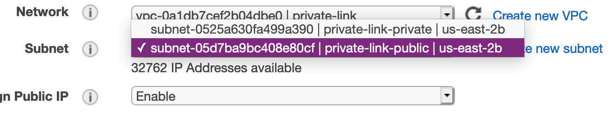
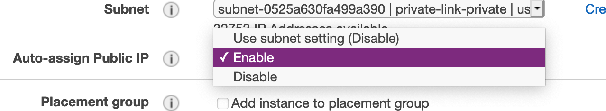
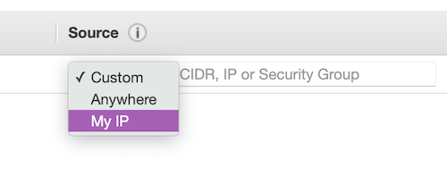

# Creating a ROSA cluster with Private Link enabled

## Prerequisites

* [AWS CLI](https://docs.aws.amazon.com/cli/latest/userguide/install-cliv2.html)
* [Rosa CLI](https://github.com/openshift/rosa/releases/tag/v1.0.8) v1.0.8
* [jq](https://stedolan.github.io/jq/download/)

## Create VPC and Subnets

The following instructions use the AWS CLI to create the necessary networking to deploy a Private Link ROSA cluster into a Single AZ and are intended to be a guide. Ideally you would use an Automation tool like Ansible or Terraform to manage your VPCs.

### Option 1 - VPC with a private subnet and AWS Site-to-Site VPN access.

Todo

### Option 2 - VPC with public and private subnets and AWS Site-to-Site VPN access

Todo

### Option 3 - VPC with public and private subnets (NAT)

This will create both a Private and Public subnet. All cluster resources will live in the private subnet, the public subnet only exists to NAT the egress traffic to the Internet.

> As an alternative use the Terraform instructions provided [here](../byo-vpc) then skip down to the rosa create command.

1. Set a Cluster name

    ```
    ROSA_CLUSTER_NAME=private-link
    ```

1. Create a VPC to install a ROSA cluster into

    ```
    VPC_ID=`aws ec2 create-vpc --cidr-block 10.0.0.0/16 | jq -r .Vpc.VpcId`

    aws ec2 create-tags --resources $VPC_ID \
      --tags Key=Name,Value=$ROSA_CLUSTER_NAME | jq .

    aws ec2 modify-vpc-attribute --vpc-id $VPC_ID --enable-dns-hostnames | jq .
    ```

1. Create a Public Subnet for the cluster to NAT egress traffic out of

    ```bash
    PUBLIC_SUBNET=`aws ec2 create-subnet --vpc-id $VPC_ID --cidr-block 10.0.128.0/17 | jq -r .Subnet.SubnetId`

    aws ec2 create-tags --resources $PUBLIC_SUBNET \
      --tags Key=Name,Value=$ROSA_CLUSTER_NAME-public | jq .
    ```

1. Create a Private Subnet for the cluster machines to live in

    ```bash
    PRIVATE_SUBNET=`aws ec2 create-subnet --vpc-id $VPC_ID --cidr-block 10.0.0.0/17 | jq -r .Subnet.SubnetId`

    aws ec2 create-tags --resources $PRIVATE_SUBNET \
      --tags Key=Name,Value=$ROSA_CLUSTER_NAME-private | jq .
    ```

1. Create an Internet Gateway for NAT egress traffic

    ```bash
    I_GW=`aws ec2 create-internet-gateway | jq -r .InternetGateway.InternetGatewayId`
    aws ec2 attach-internet-gateway --vpc-id $VPC_ID --internet-gateway-id $I_GW | jq .

    aws ec2 create-tags --resources $I_GW \
      --tags Key=Name,Value=$ROSA_CLUSTER_NAME | jq .
    ```

1. Create a Route Table for NAT egress traffic

    ```bash
    R_TABLE=`aws ec2 create-route-table --vpc-id $VPC_ID | jq -r .RouteTable.RouteTableId`

    aws ec2 create-route --route-table-id $R_TABLE --destination-cidr-block 0.0.0.0/0 --gateway-id $I_GW | jq .

    aws ec2 describe-route-tables --route-table-id $R_TABLE | jq .

    aws ec2 associate-route-table --subnet-id $PUBLIC_SUBNET --route-table-id $R_TABLE | jq .

    aws ec2 create-tags --resources $R_TABLE \
      --tags Key=Name,Value=$ROSA_CLUSTER_NAME | jq .
    ```

1. Create a NAT Gateway for the Private network

    ```bash
    EIP=`aws ec2 allocate-address --domain vpc | jq -r .AllocationId`
    NAT_GW=`aws ec2 create-nat-gateway --subnet-id $PUBLIC_SUBNET \
      --allocation-id $EIP | jq -r .NatGateway.NatGatewayId`

    aws ec2 create-tags --resources $EIP --resources $NAT_GW \
      --tags Key=Name,Value=$ROSA_CLUSTER_NAME | jq .
    ```

1. Create a Route Table for the Private subnet to the NAT

    ```bash
    R_TABLE_NAT=`aws ec2 create-route-table --vpc-id $VPC_ID | jq -r .RouteTable.RouteTableId`

    while ! aws ec2 describe-route-tables --route-table-id $R_TABLE_NAT \
      | jq .; do sleep 1; done

    aws ec2 create-route --route-table-id $R_TABLE_NAT --destination-cidr-block 0.0.0.0/0 --gateway-id $NAT_GW | jq .

    aws ec2 associate-route-table --subnet-id $PRIVATE_SUBNET --route-table-id $R_TABLE_NAT | jq .

    aws ec2 create-tags --resources $R_TABLE_NAT $EIP \
      --tags Key=Name,Value=$ROSA_CLUSTER_NAME-private | jq .
    ```

## Deploy ROSA

1. Create ROSA cluster in the private subnet

    ```bash
    rosa create cluster --private-link \
      --cluster-name=$ROSA_CLUSTER_NAME \
      --machine-cidr=10.0.0.0/16 \
      --subnet-ids=$PRIVATE_SUBNET
    ```

## Test Connectivity

1. Create an Instance to use as a jump host

    **TODO: CLI instructions**

    **Through the GUI:**
      
      1. Navigate to the EC2 console and launch a new instance

      1. Select the AMI for your instance, if you don't have a standard, the Amazon Linux 2 AMI works just fine

      1. Choose your instance type, the t2.micro/free tier is sufficient for our needs, and click **Next: Configure Instance Details**

      1. Change the **Network** settings to setup this host inside your _private-link_ VPC  
      

      1. Change the **Subnet** setting to use the _private-link-public_ subnet  
      

      1. Change **Auto-assign Public IP** to _Enable_  
      

      1. Default settings for Storage and Tags are OK, if you do not need to change them for your own reasons, select **6. Configure Security Group** from the top navigation or click through using the **Next** buttons

      1. If you already have a security group created to allow access from your computer to AWS, choose **Select an existing security group** and choose that group from the list and skip to **Review and Launch**. Otherwise, select **Create a new security group** and continue.

      1. To allow access only from your current public IP, change the **Source** heading to use _My IP_  
      

      1. Click **Review and Launch**, verify all settings are correct and follow the standard AWS instructions for finalizing the setup and selecting/creating the security keys.

      1. Once launched, open the instance summary for the jump host instance and note the public IP address.


1. Create a ROSA admin user and save the login command for use later

    ```
    rosa create admin -c $ROSA_CLUSTER_NAME
    ```

1. Note the DNS name of your private cluster, use the `rosa describe` command if needed

  ```
  rosa describe cluster -c private-link
  ```

1. update /etc/hosts to point the openshift domains to localhost. Use the DNS of your openshift cluster as described in the previous step in place of `$YOUR_OPENSHIFT_DNS` below

    ```
    127.0.0.1 api.$YOUR_OPENSHIFT_DNS
    127.0.0.1 console-openshift-console.apps.$YOUR_OPENSHIFT_DNS
    127.0.0.1 oauth-openshift.apps.$YOUR_OPENSHIFT_DNS
    ```


1. SSH to that instance, tunneling traffic for the appropriate hostnames. Be sure to use your new/existing private key, the OpenShift DNS for `$YOUR_OPENSHIFT_DNS` and your jump host IP for `$YOUR_EC2_IP`

    ```bash
      sudo ssh -i PATH/TO/YOUR_KEY.pem \
      -L 6443:api.$YOUR_OPENSHIFT_DNS:6443 \
      -L 443:console-openshift-console.apps.$YOUR_OPENSHIFT_DNS:443 \
      -L 80:console-openshift-console.apps.$YOUR_OPENSHIFT_DNS:80 \
       ec2-user@$YOUR_EC2_IP
    ```

1. Log into the cluster using oc login command from the create admin command above. ex.

    ```bash
    oc login https://api.private-test.3d1n.p1.openshiftapps.com:6443 --username cluster-admin --password GQSGJ-daqfN-8QNY3-tS9gU
    ```

1. Check that you can access the Console by opening the console url in your browser.

## Cleanup

1. Delete ROSA

    ```bash
    rosa delete cluster -c $ROSA_CLUSTER_NAME -y
    ```

1. Delete AWS resources

    ```bash
    aws ec2 delete-nat-gateway --nat-gateway-id $NAT_GW | jq .
    aws ec2 release-address --allocation-id=$EIP | jq .
    aws ec2 detach-internet-gateway --vpc-id $VPC_ID \
      --internet-gateway-id $I_GW | jq .
    aws ec2 delete-subnet --subnet-id=$PRIVATE_SUBNET | jq .
    aws ec2 delete-subnet --subnet-id=$PUBLIC_SUBNET | jq .
    aws ec2 delete-route-table --route-table-id=$R_TABLE | jq .
    aws ec2 delete-route-table --route-table-id=$R_TABLE_NAT | jq .
    aws ec2 delete-vpc --vpc-id=$VPC_ID | jq .
    ```

