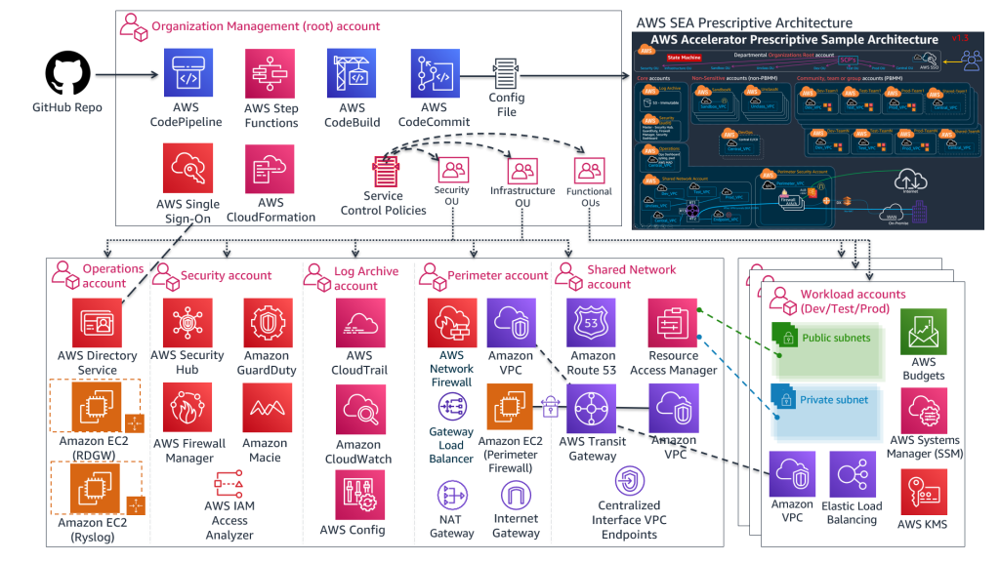

# Integrating Red Hat OpenShift Service on AWS (ROSA) and AWS Secure Environment Accelerator (ASEA) Landing Zones

**Tyler Stacey**
*Last updated 28 Sep 2022*

The [AWS Secure Environment Accelerator (ASEA)](https://aws-samples.github.io/aws-secure-environment-accelerator/) is a tool developed and designed by AWS to help deploy and operate a secure landing zone on AWS. ASEA creates core management and operations accounts, configures networking, identity services, cloud security services, centralized logging and alerting. In this post you will learn how to deploy Red Hat OpenShift Service on AWS (ROSA) in an ASEA environment.

Thus guide is validated for ASEA v1.5.3 ([using the full configuration](https://github.com/aws-samples/aws-secure-environment-accelerator/blob/main/reference-artifacts/SAMPLE_CONFIGS/config.example.json)) and ROSA v4.11.4.

## Prerequisites

- [AWS CLI](https://docs.aws.amazon.com/cli/latest/userguide/install-cliv2.html)
- [Rosa CLI](https://github.com/openshift/rosa/releases/tag/v1.2.6) v1.2.6
- Knowledge of ASEA operations and troubleshooting
- Pre-deployed ASEA v1.5.3

## ASEA Configuration

ASEA is delivered with a sample configuration file which deploys an opinionated and prescriptive architecture designed to help meet the security and operational requirements of many AWS customers around the world. The sample deployment configuration of the ASEA provides a prescriptive architecture that helps customers meet NIST 800-53 and/or Canadian Center for Cyber Security (CCCS) Cloud Medium Control Profile:



To best support the automated deployment of ROSA clusters some modifications to the default configuration need to be made:

### Addition of a ROSA Workload Organizational Unit

A separate ROSA Organizational Unit (OU) is created in AWS Organizations through the ASEA configuration files to support the configuration required by the service. The ROSA OU has the following characteristics:

- Dynamic Virtual Private Cloud (VPC) generation: The CCCS Cloud Medium Profile requires centralized ingress and egress of network traffic in the cloud. To support this the ROSA account Virtual Private Clouds (VPCs) must be attached to the transit gateway and have appropriate routes to direct traffic to the deployed firewall solution. A separate VPC is required for ROSA based on the requirement to create a Route53 Private Hosted Zone (PHZ) during the cluster installation. Currently, shared VPCs do not support the creation of a PHZ in an account separate from the VPC. Support for pre-existing Route53 hosted zones is currently in development: https://github.com/openshift-cs/managed-openshift/issues/70 

- Private Marketplace (PMP) Access to ROSA: Terms and conditions for the use of ROSA are enabled through the Private Marketplace when the ROSA service is enabled on each account. This is a one-time activity per account.

- Account Structure: We recommend deploying ROSA into dedicated member accounts based on intended usage: Development, Testing, and Production. This allows for tighter access controls and allows for account resources to be dedicated to each type of cluster.

To support this configuration, the following code block must be added to the ASEA config file as a new OU:

```json
"ROSA": {
    "type": "workload",
    "description": "The ROSA OU is used to support the configuration required by the service.",
    "scps": [
        "Guardrails-Part-0",
        "Guardrails-Part-1",
        "Guardrails-Sensitive"
    ],
    "default-budgets": {
        "name": "Default ROSA Budget",
        "period": "Monthly",
        "amount": 2000,
        "include": [
            "Upfront-reservation-fees",
            "Recurring-reservation-charges",
            "Other-subscription-costs",
            "Taxes",
            "Support-charges",
            "Discounts"
        ],
        "alerts": [
            {
                "type": "Actual",
                "threshold-percent": 50,
                "emails": [
                    "MYEMAIL+aseabilling@amazon.com"
                ]
            },
            {
                "type": "Actual",
                "threshold-percent": 75,
                "emails": [
                    "MYEMAIL+aseabilling@amazon.com"
                ]
            },
            {
                "type": "Actual",
                "threshold-percent": 90,
                "emails": [
                    "MYEMAIL+aseabilling@amazon.com"
                ]
            },
            {
                "type": "Actual",
                "threshold-percent": 100,
                "emails": [
                    "MYEMAIL+aseabilling@amazon.com"
                ]
            }
        ]
    },
    "vpc": [
        {
            "deploy": "local",
            "name": "${CONFIG::OU_NAME}",
            "description": "This VPC is deployed locally in each ROSA account and each VPC will be dynamically assigned unique CIDR ranges and connected to the TGW to enable central ingress/egress.",
            "cidr-src": "dynamic",
            "cidr": [
                {
                    "size": 20,
                    "pool": "main"
                }
            ],
            "region": "${HOME_REGION}",
            "use-central-endpoints": true,
            "flow-logs": "BOTH",
            "dns-resolver-logging": true,
            "subnets": [
                {
                    "name": "TGW",
                    "share-to-ou-accounts": false,
                    "share-to-specific-accounts": [],
                    "definitions": [
                        {
                            "az": "a",
                            "route-table": "${CONFIG::VPC_NAME}VPC_Common",
                            "cidr": {
                                "pool": "main",
                                "size": 27
                            }
                        },
                        {
                            "az": "b",
                            "route-table": "${CONFIG::VPC_NAME}VPC_Common",
                            "cidr": {
                                "pool": "main",
                                "size": 27
                            }
                        },
                        {
                            "az": "d",
                            "route-table": "${CONFIG::VPC_NAME}VPC_Common",
                            "cidr": {
                                "pool": "main",
                                "size": 27
                            },
                            "disabled": true
                        }
                    ]
                },
                {
                    "name": "Web",
                    "share-to-ou-accounts": false,
                    "share-to-specific-accounts": [],
                    "definitions": [
                        {
                            "az": "a",
                            "route-table": "${CONFIG::VPC_NAME}VPC_Common",
                            "cidr": {
                                "pool": "main",
                                "size": 24
                            }
                        },
                        {
                            "az": "b",
                            "route-table": "${CONFIG::VPC_NAME}VPC_Common",
                            "cidr": {
                                "pool": "main",
                                "size": 24
                            }
                        },
                        {
                            "az": "d",
                            "route-table": "${CONFIG::VPC_NAME}VPC_Common",
                            "cidr": {
                                "pool": "main",
                                "size": 24
                            },
                            "disabled": true
                        }
                    ]
                },
                {
                    "name": "App",
                    "share-to-ou-accounts": false,
                    "share-to-specific-accounts": [],
                    "definitions": [
                        {
                            "az": "a",
                            "route-table": "${CONFIG::VPC_NAME}VPC_Common",
                            "cidr": {
                                "pool": "main",
                                "size": 24
                            }
                        },
                        {
                            "az": "b",
                            "route-table": "${CONFIG::VPC_NAME}VPC_Common",
                            "cidr": {
                                "pool": "main",
                                "size": 24
                            }
                        },
                        {
                            "az": "d",
                            "route-table": "${CONFIG::VPC_NAME}VPC_Common",
                            "cidr": {
                                "pool": "main",
                                "size": 24
                            },
                            "disabled": true
                        }
                    ]
                },
                {
                    "name": "Data",
                    "share-to-ou-accounts": false,
                    "share-to-specific-accounts": [],
                    "definitions": [
                        {
                            "az": "a",
                            "route-table": "${CONFIG::VPC_NAME}VPC_Common",
                            "cidr": {
                                "pool": "main",
                                "size": 24
                            }
                        },
                        {
                            "az": "b",
                            "route-table": "${CONFIG::VPC_NAME}VPC_Common",
                            "cidr": {
                                "pool": "main",
                                "size": 24
                            }
                        },
                        {
                            "az": "d",
                            "route-table": "${CONFIG::VPC_NAME}VPC_Common",
                            "cidr": {
                                "pool": "main",
                                "size": 24
                            },
                            "disabled": true
                        }
                    ],
                    "nacls": [
                        {
                            "rule": 100,
                            "protocol": -1,
                            "ports": -1,
                            "rule-action": "deny",
                            "egress": true,
                            "cidr-blocks": [
                                {
                                    "vpc": "${CONFIG::VPC_NAME}",
                                    "subnet": [
                                        "Web"
                                    ]
                                },
                                {
                                    "vpc": "Central",
                                    "subnet": [
                                        "Data"
                                    ]
                                }
                            ]
                        },
                        {
                            "rule": 32000,
                            "protocol": -1,
                            "ports": -1,
                            "rule-action": "allow",
                            "egress": true,
                            "cidr-blocks": [
                                "0.0.0.0/0"
                            ]
                        },
                        {
                            "rule": 100,
                            "protocol": -1,
                            "ports": -1,
                            "rule-action": "deny",
                            "egress": false,
                            "cidr-blocks": [
                                {
                                    "vpc": "${CONFIG::VPC_NAME}",
                                    "subnet": [
                                        "Web"
                                    ]
                                },
                                {
                                    "vpc": "Central",
                                    "subnet": [
                                        "Data"
                                    ]
                                }
                            ]
                        },
                        {
                            "rule": 32000,
                            "protocol": -1,
                            "ports": -1,
                            "rule-action": "allow",
                            "egress": false,
                            "cidr-blocks": [
                                "0.0.0.0/0"
                            ]
                        }
                    ]
                },
                {
                    "name": "Mgmt",
                    "share-to-ou-accounts": false,
                    "share-to-specific-accounts": [],
                    "definitions": [
                        {
                            "az": "a",
                            "route-table": "${CONFIG::VPC_NAME}VPC_Common",
                            "cidr": {
                                "pool": "main",
                                "size": 26
                            }
                        },
                        {
                            "az": "b",
                            "route-table": "${CONFIG::VPC_NAME}VPC_Common",
                            "cidr": {
                                "pool": "main",
                                "size": 26
                            }
                        },
                        {
                            "az": "d",
                            "route-table": "${CONFIG::VPC_NAME}VPC_Common",
                            "cidr": {
                                "pool": "main",
                                "size": 26
                            },
                            "disabled": true
                        }
                    ]
                }
            ],
            "gateway-endpoints": [
                "s3",
                "dynamodb"
            ],
            "route-tables": [
                {
                    "name": "${CONFIG::VPC_NAME}VPC_Common",
                    "routes": [
                        {
                            "destination": "0.0.0.0/0",
                            "target": "TGW"
                        },
                        {
                            "destination": "s3",
                            "target": "s3"
                        },
                        {
                            "destination": "DynamoDB",
                            "target": "DynamoDB"
                        }
                    ]
                }
            ],
            "security-groups": [
                {
                    "name": "Mgmt",
                    "inbound-rules": [
                        {
                            "description": "Mgmt RDP/SSH Traffic Inbound",
                            "type": [
                                "RDP",
                                "SSH"
                            ],
                            "source": "${RANGE-RESTRICT}"
                        },
                        {
                            "description": "Central VPC Traffic Inbound",
                            "type": [
                                "ALL"
                            ],
                            "source": [
                                {
                                    "vpc": "Central",
                                    "subnet": [
                                        "Web",
                                        "App",
                                        "Mgmt",
                                        "App2"
                                    ]
                                }
                            ]
                        }
                    ],
                    "outbound-rules": [
                        {
                            "description": "All Outbound",
                            "type": [
                                "ALL"
                            ],
                            "source": [
                                "0.0.0.0/0"
                            ]
                        }
                    ]
                },
                {
                    "name": "Web",
                    "inbound-rules": [
                        {
                            "description": "World Web Traffic Inbound",
                            "type": [
                                "HTTP",
                                "HTTPS"
                            ],
                            "source": [
                                "0.0.0.0/0"
                            ]
                        },
                        {
                            "description": "Central VPC Traffic Inbound",
                            "type": [
                                "ALL"
                            ],
                            "source": [
                                {
                                    "vpc": "Central",
                                    "subnet": [
                                        "Web",
                                        "App",
                                        "Mgmt",
                                        "App2"
                                    ]
                                }
                            ]
                        },
                        {
                            "description": "Local Mgmt Traffic Inbound",
                            "type": [
                                "ALL"
                            ],
                            "source": [
                                {
                                    "security-group": [
                                        "Mgmt"
                                    ]
                                }
                            ]
                        }
                    ],
                    "outbound-rules": [
                        {
                            "description": "All Outbound",
                            "type": [
                                "ALL"
                            ],
                            "source": [
                                "0.0.0.0/0"
                            ]
                        }
                    ]
                },
                {
                    "name": "App",
                    "inbound-rules": [
                        {
                            "description": "Central VPC Traffic Inbound",
                            "type": [
                                "ALL"
                            ],
                            "source": [
                                {
                                    "vpc": "Central",
                                    "subnet": [
                                        "Web",
                                        "App",
                                        "Mgmt",
                                        "App2"
                                    ]
                                }
                            ]
                        },
                        {
                            "description": "Local Mgmt Traffic Inbound",
                            "type": [
                                "ALL"
                            ],
                            "source": [
                                {
                                    "security-group": [
                                        "Mgmt"
                                    ]
                                }
                            ]
                        },
                        {
                            "description": "Local Web Tier Inbound",
                            "type": [
                                "ALL"
                            ],
                            "source": [
                                {
                                    "security-group": [
                                        "Web"
                                    ]
                                }
                            ]
                        },
                        {
                            "description": "Allow East/West Communication Inbound",
                            "type": [
                                "ALL"
                            ],
                            "source": [
                                {
                                    "security-group": [
                                        "App"
                                    ]
                                }
                            ]
                        }
                    ],
                    "outbound-rules": [
                        {
                            "description": "All Outbound",
                            "type": [
                                "ALL"
                            ],
                            "source": [
                                "0.0.0.0/0"
                            ]
                        }
                    ]
                },
                {
                    "name": "Data",
                    "inbound-rules": [
                        {
                            "description": "Central VPC Traffic Inbound",
                            "type": [
                                "ALL"
                            ],
                            "source": [
                                {
                                    "vpc": "Central",
                                    "subnet": [
                                        "Web",
                                        "App",
                                        "Mgmt",
                                        "App2"
                                    ]
                                }
                            ]
                        },
                        {
                            "description": "Local Mgmt Traffic Inbound",
                            "type": [
                                "ALL"
                            ],
                            "source": [
                                {
                                    "security-group": [
                                        "Mgmt"
                                    ]
                                }
                            ]
                        },
                        {
                            "description": "Local App DB Traffic Inbound",
                            "type": [
                                "MSSQL",
                                "MYSQL/AURORA",
                                "REDSHIFT",
                                "POSTGRESQL",
                                "ORACLE-RDS"
                            ],
                            "source": [
                                {
                                    "security-group": [
                                        "App"
                                    ]
                                }
                            ]
                        },
                        {
                            "description": "Allow East/West Communication Inbound",
                            "type": [
                                "ALL"
                            ],
                            "source": [
                                {
                                    "security-group": [
                                        "Data"
                                    ]
                                }
                            ]
                        }
                    ],
                    "outbound-rules": [
                        {
                            "description": "All Outbound",
                            "type": [
                                "ALL"
                            ],
                            "source": [
                                "0.0.0.0/0"
                            ]
                        }
                    ]
                }
            ],
            "tgw-attach": {
                "associate-to-tgw": "Main",
                "account": "shared-network",
                "associate-type": "ATTACH",
                "tgw-rt-associate": [
                    "shared"
                ],
                "tgw-rt-propagate": [
                    "core",
                    "shared",
                    "segregated"
                ],
                "blackhole-route": false,
                "attach-subnets": [
                    "TGW"
                ],
                "options": [
                    "DNS-support"
                ]
            }
        }
    ],
    "iam": {
        "users": [],
        "policies": [
            {
                "policy-name": "Default-Boundary-Policy",
                "policy": "boundary-policy.txt"
            }
        ],
        "roles": [
            {
                "role": "EC2-Default-SSM-AD-Role",
                "type": "ec2",
                "ssm-log-archive-write-access": true,
                "policies": [
                    "AmazonSSMManagedInstanceCore",
                    "AmazonSSMDirectoryServiceAccess",
                    "CloudWatchAgentServerPolicy"
                ],
                "boundary-policy": "Default-Boundary-Policy"
            }
        ]
    },
    "ssm-automation": [
        {
            "account": "operations",
            "regions": [
                "${HOME_REGION}"
            ],
            "documents": [
                "SSM-ELB-Enable-Logging",
                "Put-S3-Encryption",
                "Attach-IAM-Instance-Profile",
                "Attach-IAM-Role-Policy"
            ]
        }
    ],
    "aws-config": [
        {
            "excl-regions": [
                "ap-northeast-3"
            ],
            "rules": [
                "EC2-INSTANCE-PROFILE",
                "EC2-INSTANCE-PROFILE-PERMISSIONS",
                "ELB_LOGGING_ENABLED",
                "S3_BUCKET_SERVER_SIDE_ENCRYPTION_ENABLED",
                "ACM_CERTIFICATE_EXPIRATION_CHECK",
                "ALB_WAF_ENABLED",
                "API_GW_CACHE_ENABLED_AND_ENCRYPTED",
                "CLOUD_TRAIL_ENABLED",
                "CLOUDTRAIL_S3_DATAEVENTS_ENABLED",
                "CLOUDTRAIL_SECURITY_TRAIL_ENABLED",
                "CLOUDWATCH_ALARM_ACTION_CHECK",
                "CW_LOGGROUP_RETENTION_PERIOD_CHECK",
                "DB_INSTANCE_BACKUP_ENABLED",
                "DYNAMODB_IN_BACKUP_PLAN",
                "DYNAMODB_TABLE_ENCRYPTED_KMS",
                "EBS_IN_BACKUP_PLAN",
                "EC2_INSTANCE_DETAILED_MONITORING_ENABLED",
                "EC2_MANAGEDINSTANCE_PATCH_COMPLIANCE_STATUS_CHECK",
                "EC2_VOLUME_INUSE_CHECK",
                "ELASTICACHE_REDIS_CLUSTER_AUTOMATIC_BACKUP_CHECK",
                "ELB_ACM_CERTIFICATE_REQUIRED",
                "ELB_CROSS_ZONE_LOAD_BALANCING_ENABLED",
                "EMR_KERBEROS_ENABLED",
                "GUARDDUTY_NON_ARCHIVED_FINDINGS",
                "IAM_GROUP_HAS_USERS_CHECK",
                "IAM_PASSWORD_POLICY",
                "IAM_USER_GROUP_MEMBERSHIP_CHECK",
                "INCOMING_SSH_DISABLED",
                "INSTANCES_IN_VPC",
                "INTERNET_GATEWAY_AUTHORIZED_VPC_ONLY",
                "RDS_IN_BACKUP_PLAN",
                "REDSHIFT_CLUSTER_CONFIGURATION_CHECK",
                "RESTRICTED_INCOMING_TRAFFIC",
                "S3_BUCKET_POLICY_GRANTEE_CHECK",
                "S3_BUCKET_VERSIONING_ENABLED",
                "SAGEMAKER_ENDPOINT_CONFIGURATION_KMS_KEY_CONFIGURED",
                "SAGEMAKER_NOTEBOOK_INSTANCE_KMS_KEY_CONFIGURED",
                "SECURITYHUB_ENABLED",
                "VPC_SG_OPEN_ONLY_TO_AUTHORIZED_PORTS",
                "WAFV2_LOGGING_ENABLED"
            ],
            "remediate-regions": [
                "${HOME_REGION}"
            ]
        }
    ]
}
```

### Creation of the ROSA Workload Account

Following the Development/Testing/Production account structure of the ASEA requires that separate accounts be created for each environment in the ROSA OU; this allows the administrators to restrict account access for each type of environment. It is recommended that account creation happens just-in-time to reduce costs incurred by each account.

To add the required accounts, modify the `workload-account-configs` section of the ASEA configuration to include the following account:

```json
"rosa-dev": {
    "account-name": "rosa-dev",
    "email": "MYEMAIL+rosadev@amazon.com",
    "ou": "ROSA",
    "ou-path": "ROSA",
    "src-filename": "config.json"
}
```

## Enabling ROSA

One of the key security features of this architecture is the use of highly restrictive Service Control Policies (SCPs) that allow for fine-grained control of access to AWS services and APIs by users and member accounts. Because ROSA automates tasks typically performed by privileged administrators, ASEA deployed SCPs must be temporarily modified to enable ROSA functionality. This is a one time activity per account where ROSA clusters will be deployed.

To support the most restrictive SCPs of ASEA we will consider the following SCPs for the installation:

- ASEA-Guardrails-Part0-WkldOUs
- ASEA-Guardrails-Part1
- ASEA-Guardrails-Sensitive

To prepare your ASEA environment and enable ROSA perform the following steps:

1. Create the ROSA-TempAdministrator role with AdministratorAccess in the required account.

2. In config.json, only apply `Guardrails-Part-0`, `Guardrails-Part-1` to the ROSA OU.

3. Run the main State Machine for ASEA and wait for successful completion.

4. Enable the ROSA service in the AWS Console in the required account using the ROSA-TempAdministrator
role.

5. In config.json, re-apply Guardrails-Part-0, Guardrails-Part-1, Guardrails-Sensitive.

6. Re-run State Machine and wait for successful completion.

7. You can now delete the ROSA-TempAdministrator role in this account.

## Deploy a ROSA cluster

In order to install ROSA in a high security environment, the custom KMS, PrivateLink and STS cluster patterns should be followed. For more information about these patterns please see the following information:

- https://aws.amazon.com/blogs/containers/red-hat-openshift-service-on-aws-private-clusters-with-aws-privatelink/

- https://docs.openshift.com/rosa/rosa_getting_started_sts/rosa-sts-getting-started-workflow.html

### Prepare the ROSA Workload Account

Log in to the `rosa-dev` account with a user that has been assigned AdministratorAccess and run the following command using the aws CLI:

```bash
export AWS_REGION="ca-central-1"
aws iam create-service-linked-role --aws-service-name "elasticloadbalancing.amazonaws.com"
 ```

Ensure the account meets the minimum required service quotas for ROSA: https://docs.openshift.com/rosa/rosa_install_access_delete_clusters/rosa_getting_started_iam/rosa-required-aws-service-quotas.html#rosa-required-aws-service-quotas

Verify that the following egress firewall requirements are met: https://docs.openshift.com/rosa/rosa_install_access_delete_clusters/rosa_getting_started_iam/rosa-aws-prereqs.html#osd-aws-privatelink-firewall-prerequisites_prerequisites

### Create the required ROSA Account Roles

Creation of the account roles is a one-time activity, create them with the following command:

```bash
rosa create account-roles --mode manual --prefix ROSA
```

Using `--mode manual` generates the aws CLI commands and JSON files needed to create the account-wide roles and policies. Review the the roles and policies and run the provided commands from the working directory.

### Create the Required KMS Key and Initial Policy

The custom KMS key is used to encrypt EC2 EBS node volumes and the EBS volumes that are created by the default `StorageClass` on OpenShift.

Create a new Symmetric KMS Key for EBS Encryption:

```bash
KMS_ARN=$(aws kms create-key --region $AWS_REGION --description 'rosa-ebs-key' --query KeyMetadata.Arn --output text)
```

Generate the necessary key policy to allow the ROSA STS roles to access the key. Use the below command to populate a sample policy, or create your own.

```bash
AWS_ACCOUNT=$(aws sts get-caller-identity --query Account --output text); cat << EOF > rosa-key-policy.json
{
    "Version": "2012-10-17",
    "Id": "rosa-key-policy-1",
    "Statement": [
        {
            "Sid": "Enable IAM User Permissions",
            "Effect": "Allow",
            "Principal": {
                "AWS": "arn:aws:iam::${AWS_ACCOUNT}:root"
            },
            "Action": "kms:*",
            "Resource": "*"
        },
        {
            "Sid": "Allow ROSA use of the key",
            "Effect": "Allow",
            "Principal": {
                "AWS": [
                    "arn:aws:iam::${AWS_ACCOUNT}:role/ROSA-Support-Role",
                    "arn:aws:iam::${AWS_ACCOUNT}:role/ROSA-Installer-Role",
                    "arn:aws:iam::${AWS_ACCOUNT}:role/ROSA-Worker-Role",
                    "arn:aws:iam::${AWS_ACCOUNT}:role/ROSA-ControlPlane-Role"
                ]
            },
            "Action": [
                "kms:Encrypt",
                "kms:Decrypt",
                "kms:ReEncrypt*",
                "kms:GenerateDataKey*",
                "kms:DescribeKey"
            ],
            "Resource": "*"
        },
        {
            "Sid": "Allow attachment of persistent resources",
            "Effect": "Allow",
            "Principal": {
                "AWS": [
                    "arn:aws:iam::${AWS_ACCOUNT}:role/ROSA-Support-Role",
                    "arn:aws:iam::${AWS_ACCOUNT}:role/ROSA-Installer-Role",
                    "arn:aws:iam::${AWS_ACCOUNT}:role/ROSA-Worker-Role",
                    "arn:aws:iam::${AWS_ACCOUNT}:role/ROSA-ControlPlane-Role"
                ]
            },
            "Action": [
                "kms:CreateGrant",
                "kms:ListGrants",
                "kms:RevokeGrant"
            ],
            "Resource": "*",
            "Condition": {
                "Bool": {
                    "kms:GrantIsForAWSResource": "true"
                }
            }
        }
    ]
}
EOF
```

Apply the newly generated key policy to the custom KMS key.

```bash
aws kms put-key-policy --key-id $KMS_ARN \
--policy file://rosa-key-policy.json \
--policy-name default
```

### Deploy a single AZ, single subnet, PrivateLink, STS ROSA cluster

This deployment configuration should only be used for development. Production clusters should use 3 Availability Zones (AZs) with the `--multi-az` flag enabled. This requires additional configuration of ASEA and is outside the scope of this post.

To deploy the cluster, you must gather the following info:

- `--subnet-ids`: AWS subnet IDs that the cluster will be deployed in, the `App` subnets from the ASEA deployment are recommended.
- `--machine-cidr`: The VPC CIDR in the `rosa-dev` account deployed by the ASEA.

Deploy the cluster with the following command:

```bash
ROSA_CLUSTER_NAME=rosa-ct1
rosa create cluster --cluster-name $ROSA_CLUSTER_NAME --sts --private-link \
--role-arn arn:aws:iam::$AWS_ACCOUNT:role/ROSA-Installer-Role \
--support-role-arn arn:aws:iam::$AWS_ACCOUNT:role/ROSA-Support-Role \
--controlplane-iam-role arn:aws:iam::$AWS_ACCOUNT:role/ROSA-ControlPlane-Role \
--worker-iam-role arn:aws:iam::$AWS_ACCOUNT:role/ROSA-Worker-Role \
--operator-roles-prefix ROSA-$ROSA_CLUSTER_NAME --region ca-central-1 --version 4.11.4 \
--compute-nodes 2 --compute-machine-type m5.xlarge --machine-cidr 10.0.0.0/20 \
--service-cidr 172.30.0.0/16 --pod-cidr 10.128.0.0/14 --host-prefix 23 \
--subnet-ids subnet-058aa558a63da3d51 --etcd-encryption --enable-customer-managed-key \
--kms-key-arn $KMS_ARN  --watch --debug
```

While the cluster is creating, create the operator IAM roles:

```bash
rosa create operator-roles --mode manual --cluster $ROSA_CLUSTER_NAME
```

Review the output IAM Role Policy documents and AWS CLI commands for accuracy and run the provided commands.

After creating the Operator Roles, modify the KMS key policy to allow the CSI driver to function correctly:

```bash
AWS_ACCOUNT=$(aws sts get-caller-identity --query Account --output text); cat << EOF > rosa-key-policy.json
{
    "Version": "2012-10-17",
    "Id": "rosa-key-policy-1",
    "Statement": [
        {
            "Sid": "Enable IAM User Permissions",
            "Effect": "Allow",
            "Principal": {
                "AWS": "arn:aws:iam::${AWS_ACCOUNT}:root"
            },
            "Action": "kms:*",
            "Resource": "*"
        },
        {
            "Sid": "Allow ROSA use of the key",
            "Effect": "Allow",
            "Principal": {
                "AWS": [
                    "arn:aws:iam::${AWS_ACCOUNT}:role/ROSA-Support-Role",
                    "arn:aws:iam::${AWS_ACCOUNT}:role/ROSA-Installer-Role",
                    "arn:aws:iam::${AWS_ACCOUNT}:role/ROSA-Worker-Role",
                    "arn:aws:iam::${AWS_ACCOUNT}:role/ROSA-ControlPlane-Role",
                    "arn:aws:iam::${AWS_ACCOUNT}:role/ROSA-${ROSA_CLUSTER_NAME}-openshift-cluster-csi-drivers-ebs-cloud-credent",
                    "arn:aws:iam::${AWS_ACCOUNT}:role/ROSA-${ROSA_CLUSTER_NAME}-openshift-machine-api-aws-cloud-credentials"
                ]
            },
            "Action": [
                "kms:Encrypt",
                "kms:Decrypt",
                "kms:ReEncrypt*",
                "kms:GenerateDataKey*",
                "kms:DescribeKey"
            ],
            "Resource": "*"
        },
        {
            "Sid": "Allow attachment of persistent resources",
            "Effect": "Allow",
            "Principal": {
                "AWS": [
                    "arn:aws:iam::${AWS_ACCOUNT}:role/ROSA-Support-Role",
                    "arn:aws:iam::${AWS_ACCOUNT}:role/ROSA-Installer-Role",
                    "arn:aws:iam::${AWS_ACCOUNT}:role/ROSA-Worker-Role",
                    "arn:aws:iam::${AWS_ACCOUNT}:role/ROSA-ControlPlane-Role",
                    "arn:aws:iam::${AWS_ACCOUNT}:role/ROSA-${ROSA_CLUSTER_NAME}-openshift-cluster-csi-drivers-ebs-cloud-credent",
                    "arn:aws:iam::${AWS_ACCOUNT}:role/ROSA-${ROSA_CLUSTER_NAME}-openshift-machine-api-aws-cloud-credentials"
                ]
            },
            "Action": [
                "kms:CreateGrant",
                "kms:ListGrants",
                "kms:RevokeGrant"
            ],
            "Resource": "*",
            "Condition": {
                "Bool": {
                    "kms:GrantIsForAWSResource": "true"
                }
            }
        }
    ]
}
EOF
```

Apply the newly updated key policy to the custom KMS key.

```bash
aws kms put-key-policy --key-id $KMS_ARN \
--policy file://rosa-key-policy.json \
--policy-name default
```

After creating the operator roles, create the required OIDC provider:

```bash
rosa create oidc-provider --mode auto --cluster $ROSA_CLUSTER_NAME
```

Wait for the cluster deployment to finish.

### Access the cluster

The ROSA cluster can only be accessed from a machine that has routes to the ROSA VPC. One way to gain this access is to use a jumphost in the management subnet and use an AWS Systems Manager terminal session to access the jumphost securely.

Create a temporary Admin user with `cluster-admin` privileges:

```bash
rosa create admin -c $ROSA_CLUSTER_NAME
```

Run the resulting login statement from output. It may take up to 15 minutes before authentication is fully synced.

Verify the default persistent volumes in the cluster.

```bash
oc get pv
```

Output:

```bash
NAME                                       CAPACITY   ACCESS MODES   RECLAIM POLICY   STATUS   CLAIM                                                        STORAGECLASS       REASON   AGE
pvc-00dac374-a45e-43fa-a313-ae0491e8edf1   10Gi       RWO            Delete           Bound    openshift-monitoring/alertmanager-data-alertmanager-main-1   gp3-customer-kms            26m
pvc-7d211496-4ddf-4200-921c-1404b754afa5   10Gi       RWO            Delete           Bound    openshift-monitoring/alertmanager-data-alertmanager-main-0   gp3-customer-kms            26m
pvc-b5243cef-ec30-4e5c-a348-aeb8136a908c   100Gi      RWO            Delete           Bound    openshift-monitoring/prometheus-data-prometheus-k8s-0        gp3-customer-kms            26m
pvc-ec60c1cf-72cf-4ac6-ab12-8e9e5afdc15f   100Gi      RWO            Delete           Bound    openshift-monitoring/prometheus-data-prometheus-k8s-1        gp3-customer-kms            26m
```

You should see the StorageClass set to `gp3-customer-kms`. This is the default StorageClass which is encrypted using the customer-provided key.
