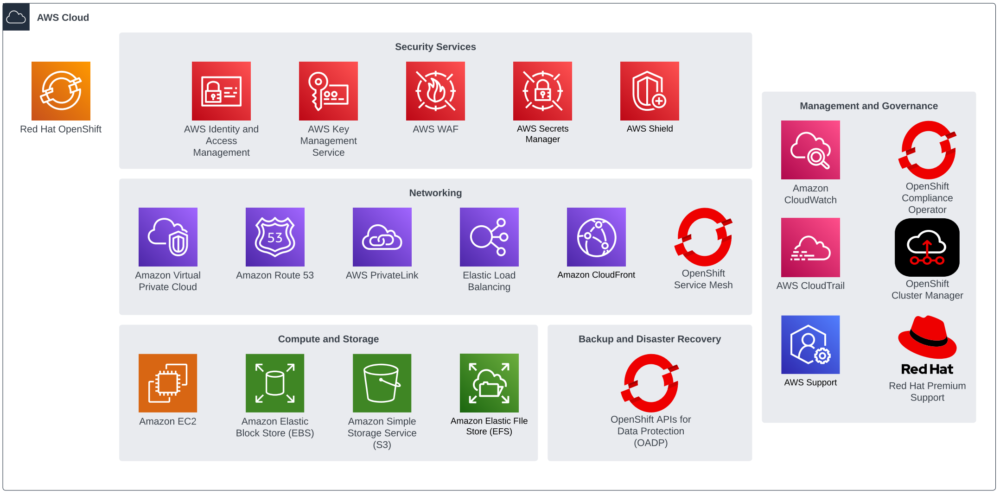
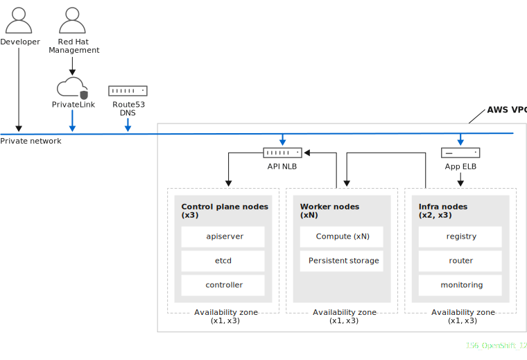

# Security Reference Architecture for ROSA

**Tyler Stacey**

*Last updated 30 Sep 2022*

The **Security Reference Architecture for ROSA** is a set of guidelines for deploying Red Hat OpenShift on AWS (ROSA) clusters to support high-security production workloads that align with Red Hat and AWS best practices.

This overall architectural guidance compliments detailed, specific recommendations for AWS services and Red Hat OpenShift Container Platform.

The Security Reference Architecture (SRA) for ROSA is a living document and is updated periodically based on new feature releases, customer feedback and evolving security best practices.



This document is divided into the following sections:

- ROSA Day 1 Configuration
- ROSA Day 2 Security and Operations

## ROSA Day 1 Configuration

ROSA Day 1 configurations are applied to the cluster at the time it is created; they cannot be modified after the cluster has been deployed.

### AWS PrivateLink Networking

ROSA provides 3 network deployment patterns: public, private and PrivateLink. Choosing the PrivateLink option provides the most secure configuration and is recommended for customers with sensitive workloads or strict compliance requirements. The PrivateLink option uses [AWS PrivateLink](https://docs.aws.amazon.com/vpc/latest/privatelink/what-is-privatelink.html) to allow Red Hat Site Reliability Engineering (SRE) teams to manage the cluster using a private subnet connected to the cluster's PrivateLink endpoint in an existing VPC.



When using the PrivateLink model, a VPC with Private Subnets must exist in the AWS account where ROSA will be deployed. The subnets are provided to the installer via CLI flags.

Details on the PrivateLink Architecture can be found in the Red Hat and AWS documentation:

- [ROSA PrivateLink Architecture](https://docs.openshift.com/rosa/rosa_architecture/rosa_architecture_sub/rosa-architecture-models.html#osd-aws-privatelink-architecture.adoc_rosa-architecture-models)
- [ROSA PrivateLink Prerequisites](https://docs.openshift.com/rosa/rosa_install_access_delete_clusters/rosa-aws-privatelink-creating-cluster.html)
- [Firewall Egress Requirements](https://docs.openshift.com/rosa/rosa_planning/rosa-sts-aws-prereqs.html#osd-aws-privatelink-firewall-prerequisites_rosa-sts-aws-prereqs)
- [Deploy a VPC and PrivateLink Cluster](https://docs.aws.amazon.com/ROSA/latest/userguide/getting-started-private-link.html)

### AWS Security Token Service (STS) Mode

There are two supported methods for providing AWS permissions to ROSA:

- Using static IAM user credentials with AdministratorAccess policy - “ROSA with IAM Users” (not recommended)
- Using AWS Security Token Service (STS) with short-lived, dynamic tokens (preferred) - “ROSA with STS”

The STS method uses least-privilege predefined roles and policies to grant ROSA minimal permissions in the AWS account for the service to operate and is the recommended option.

As stated in the [AWS documentation](https://docs.aws.amazon.com/STS/latest/APIReference/welcome.html) AWS STS “enables you to request temporary, limited-privilege credentials for AWS Identity and Access Management (IAM) users or for users you authenticate (federated users)”. In this case, AWS STS can be used to grant the ROSA service, limited, short-term access, to resources in your AWS account. After these credentials expire (typically an hour after being requested), they are no longer recognized by AWS and they no longer have any kind of account access from API requests made with them.

Details on ROSA with STS can be found in Red Hat documentation and blogs:

- [ROSA with STS Explained](https://cloud.redhat.com/blog/what-is-aws-sts-and-how-does-red-hat-openshift-service-on-aws-rosa-use-sts)
- [AWS prerequisites for ROSA with STS](https://docs.openshift.com/rosa/rosa_planning/rosa-sts-aws-prereqs.html)
- [IAM Resources for Clusters that Use STS](https://docs.openshift.com/rosa/rosa_architecture/rosa-sts-about-iam-resources.html)

### Customer-Supplied KMS Key

By default, ROSA encrypts all [Elastic Block Store (EBS)](https://docs.aws.amazon.com/AWSEC2/latest/UserGuide/AmazonEBS.html) volumes used for node storage and Persistent Volumes (PVs) with an AWS-managed [Key Management Service (KMS)](https://docs.aws.amazon.com/kms/latest/developerguide/concepts.html) key.

Using a [Customer Managed KMS](https://docs.aws.amazon.com/kms/latest/developerguide/concepts.html#key-mgmt) key allows you to have full control over the KMS key including key policies, key rotation and deletion.

To configure a cluster with a custom KMS Key, consider the following references:

- [ROSA STS Customizations](https://docs.openshift.com/rosa/rosa_install_access_delete_clusters/rosa-sts-creating-a-cluster-with-customizations.html#rosa-sts-creating-cluster-customizations_rosa-sts-creating-a-cluster-with-customizations)
- [Deploy ROSA with a Custom KMS Key](https://mobb.ninja/docs/rosa/kms/)

### Multi-Availability Zone

ROSA clusters that will be used for production workloads should be deployed across multiple availability zones. In this configuration, control plane nodes are distributed across availability zones and at least one worker node is required in each availability zone.

This provides the highest level of fault tolerance and protects against the loss of a single availability zone in an AWS region.

### Deploy the Day 1 ROSA SRA via ROSA CLI

The Day 1 ROSA SRA can be deployed quickly using the AWS CLI and the ROSA CLI. To deploy the cluster, the following prerequisites must be met:

- AWS Account:
    - Access to an AWS account with [sufficient permissions](https://docs.openshift.com/rosa/rosa_architecture/rosa-sts-about-iam-resources.html) to deploy a ROSA cluster.
    - If using AWS Organizations and Service Control Policies (SCPs), the SCPs must not be more restrictive than the minimum permissions required to operate the service.
    - [Sufficient quota](https://docs.openshift.com/rosa/rosa_planning/rosa-sts-required-aws-service-quotas.html#rosa-sts-required-aws-service-quotas) to support the cluster deployment.
- Networking: An AWS VPC, with 3 private subnets across 3 availability zones and outbound internet access. Make note of the AWS VPC Subnet IDs as they will be needed for the installer.
- Tooling:
    - [AWS CLI](https://docs.aws.amazon.com/cli/latest/userguide/install-cliv2.html)
    - [ROSA CLI](https://github.com/openshift/rosa/releases/tag/v1.2.6) v1.2.6

#### Prepare the ROSA Workload Account

Log in to the AWS account with a user that has been assigned AdministratorAccess and run the following command using the `aws` CLI:

```bash
export AWS_REGION="ca-central-1"
aws iam create-service-linked-role --aws-service-name "elasticloadbalancing.amazonaws.com"
 ```

#### Create the required ROSA Account Roles

Creation of the account roles is a one-time activity, create them with the following command:

```bash
rosa create account-roles --mode auto -y
```

#### Create the Required KMS Key and Initial Policy

The custom KMS key is used to encrypt EC2 EBS node volumes and the EBS volumes that are created by the default `StorageClass` on OpenShift.

Create a new Symmetric KMS Key for EBS Encryption:

```bash
KMS_ARN=$(aws kms create-key --region $AWS_REGION --description 'rosa-ebs-key' --query KeyMetadata.Arn --output text)
```

Generate the necessary key policy to allow the ROSA STS roles to access the key. Use the below command to populate a sample policy, or create your own.

```bash
AWS_ACCOUNT=$(aws sts get-caller-identity --query Account --output text); cat << EOF > rosa-key-policy.json
{
    "Version": "2012-10-17",
    "Id": "rosa-key-policy-1",
    "Statement": [
        {
            "Sid": "Enable IAM User Permissions",
            "Effect": "Allow",
            "Principal": {
                "AWS": "arn:aws:iam::${AWS_ACCOUNT}:root"
            },
            "Action": "kms:*",
            "Resource": "*"
        },
        {
            "Sid": "Allow ROSA use of the key",
            "Effect": "Allow",
            "Principal": {
                "AWS": [
                    "arn:aws:iam::${AWS_ACCOUNT}:role/ManagedOpenShift-Support-Role",
                    "arn:aws:iam::${AWS_ACCOUNT}:role/ManagedOpenShift-Installer-Role",
                    "arn:aws:iam::${AWS_ACCOUNT}:role/ManagedOpenShift-Worker-Role",
                    "arn:aws:iam::${AWS_ACCOUNT}:role/ManagedOpenShift-ControlPlane-Role"
                ]
            },
            "Action": [
                "kms:Encrypt",
                "kms:Decrypt",
                "kms:ReEncrypt*",
                "kms:GenerateDataKey*",
                "kms:DescribeKey"
            ],
            "Resource": "*"
        },
        {
            "Sid": "Allow attachment of persistent resources",
            "Effect": "Allow",
            "Principal": {
                "AWS": [
                    "arn:aws:iam::${AWS_ACCOUNT}:role/ManagedOpenShift-Support-Role",
                    "arn:aws:iam::${AWS_ACCOUNT}:role/ManagedOpenShift-Installer-Role",
                    "arn:aws:iam::${AWS_ACCOUNT}:role/ManagedOpenShift-Worker-Role",
                    "arn:aws:iam::${AWS_ACCOUNT}:role/ManagedOpenShift-ControlPlane-Role"
                ]
            },
            "Action": [
                "kms:CreateGrant",
                "kms:ListGrants",
                "kms:RevokeGrant"
            ],
            "Resource": "*",
            "Condition": {
                "Bool": {
                    "kms:GrantIsForAWSResource": "true"
                }
            }
        }
    ]
}
EOF
```

Apply the newly generated key policy to the custom KMS key.

```bash
aws kms put-key-policy --key-id $KMS_ARN \
--policy file://rosa-key-policy.json \
--policy-name default
```

#### Deploy a multi-AZ, single subnet, PrivateLink, STS ROSA cluster

To deploy the cluster, you must gather the following info:

- `--subnet-ids`: AWS subnet IDs that the cluster will be deployed in
- `--machine-cidr`: The VPC CIDR 

Deploy the cluster with the following command:

```bash
ROSA_CLUSTER_NAME=rosa-ct1
rosa create cluster --cluster-name $ROSA_CLUSTER_NAME --sts --private-link \
--region ca-central-1 --version 4.11.4 \
--machine-cidr 10.0.0.0/20 \
--subnet-ids subnet-058aa558a63da3d51,subnet-058aa558a63da3d52,subnet-058aa558a63da3d53
--enable-customer-managed-key --kms-key-arn $KMS_ARN -y --mode auto
```

To complete the KMS key policy, you must retrieve the Cluster CSI and Machine API operator role names:

```bash
rosa describe cluster -c $ROSA_CLUSTER_NAME
```

The operator role names will be similar to:

```text
arn:aws:iam::${AWS_ACCOUNT}:role/<CLUSTERNAME>-<IDENTIFIER>-openshift-cluster-csi-drivers-ebs-cloud-credenti
arn:aws:iam::${AWS_ACCOUNT}:role/<CLUSTERNAME>-<IDENTIFIER>-openshift-machine-api-aws-cloud-credentials
```

Replace the role names in the following script with your **EXACT** Operator Role names:

```bash
AWS_ACCOUNT=$(aws sts get-caller-identity --query Account --output text); cat << EOF > rosa-key-policy.json
{
    "Version": "2012-10-17",
    "Id": "rosa-key-policy-1",
    "Statement": [
        {
            "Sid": "Enable IAM User Permissions",
            "Effect": "Allow",
            "Principal": {
                "AWS": "arn:aws:iam::${AWS_ACCOUNT}:root"
            },
            "Action": "kms:*",
            "Resource": "*"
        },
        {
            "Sid": "Allow ROSA use of the key",
            "Effect": "Allow",
            "Principal": {
                "AWS": [
                    "arn:aws:iam::${AWS_ACCOUNT}:role/ROSA-Support-Role",
                    "arn:aws:iam::${AWS_ACCOUNT}:role/ROSA-Installer-Role",
                    "arn:aws:iam::${AWS_ACCOUNT}:role/ROSA-Worker-Role",
                    "arn:aws:iam::${AWS_ACCOUNT}:role/<CLUSTERNAME>-<IDENTIFIER>-openshift-cluster-csi-drivers-ebs-cloud-credent",
                    "arn:aws:iam::${AWS_ACCOUNT}:role/<CLUSTERNAME>-<IDENTIFIER>-openshift-machine-api-aws-cloud-credentials"
                ]
            },
            "Action": [
                "kms:Encrypt",
                "kms:Decrypt",
                "kms:ReEncrypt*",
                "kms:GenerateDataKey*",
                "kms:DescribeKey"
            ],
            "Resource": "*"
        },
        {
            "Sid": "Allow attachment of persistent resources",
            "Effect": "Allow",
            "Principal": {
                "AWS": [
                    "arn:aws:iam::${AWS_ACCOUNT}:role/ROSA-Support-Role",
                    "arn:aws:iam::${AWS_ACCOUNT}:role/ROSA-Installer-Role",
                    "arn:aws:iam::${AWS_ACCOUNT}:role/ROSA-Worker-Role",
                    "arn:aws:iam::${AWS_ACCOUNT}:role/ROSA-ControlPlane-Role",
                    "arn:aws:iam::${AWS_ACCOUNT}:role/<CLUSTERNAME>-<IDENTIFIER>-openshift-cluster-csi-drivers-ebs-cloud-credent",
                    "arn:aws:iam::${AWS_ACCOUNT}:role/<CLUSTERNAME>-<IDENTIFIER>-openshift-machine-api-aws-cloud-credentials"
                ]
            },
            "Action": [
                "kms:CreateGrant",
                "kms:ListGrants",
                "kms:RevokeGrant"
            ],
            "Resource": "*",
            "Condition": {
                "Bool": {
                    "kms:GrantIsForAWSResource": "true"
                }
            }
        }
    ]
}
EOF
```

Apply the newly updated key policy to the custom KMS key.

```bash
aws kms put-key-policy --key-id $KMS_ARN \
--policy file://rosa-key-policy.json \
--policy-name default
```

After creating the operator roles, create the required OIDC provider:

```bash
rosa create oidc-provider --mode auto --cluster $ROSA_CLUSTER_NAME
```

Wait for the cluster deployment to finish.


## ROSA Day 2 Security and Operations

### Configure an Identity Provider

### Configure CloudWatch Log Forwarding

### Configure Custom Ingress TLS Profile

### Compliance Operator

### OpenShift Service Mesh

### Backup and Restore / Disaster Recovery

### Configure AWS WAF for Application Ingress

### Observability and Alerting
