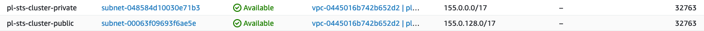
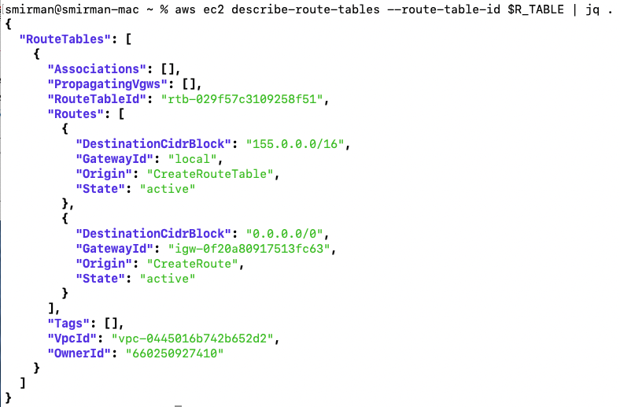

# Creating a ROSA cluster with Private Link enabled (custom VPC) and STS

**Steve Mirman**

*07/08/2021*

> This is a combination of the [private-link](../private-link) and [sts](../sts) setup documents to show the full picture

## Prerequisites

* [AWS CLI](https://docs.aws.amazon.com/cli/latest/userguide/install-cliv2.html)
* [Rosa CLI](https://github.com/openshift/rosa/releases/tag/v1.0.8) v1.0.8
* [jq](https://stedolan.github.io/jq/download/)

## Create the AWS Virtual Private Cloud (VPC) and Subnets

For this scenario, we will be using a newly created VPC with both public and private subnets.  All of the cluster resources will reside in the private subnet. The plublic subnet will be used for traffic to the Internet (egress)

1. Set a Cluster name

    ```
    ROSA_CLUSTER_NAME=pl-sts-cluster
    ```

1. Create a VPC for use by ROSA

    - Create the VPC and return the ID as `VPC_ID`
      ```
       VPC_ID=`aws ec2 create-vpc --cidr-block 155.0.0.0/16 | jq -r .Vpc.VpcId`
      ```
    - Tag the newly created VPC with the cluster name
      ```bash
        aws ec2 create-tags --resources $VPC_ID \
        --tags Key=Name,Value=$ROSA_CLUSTER_NAME | jq .
      ```
    - Configure the VPC to allow DNS hostnames for their public IP addresses
      ```bash
        aws ec2 modify-vpc-attribute --vpc-id $VPC_ID --enable-dns-hostnames | jq .
      ```
    - The new VPC should be visible in the AWS console

      

1. Create a Public Subnet to allow egress traffic to the Internet

    - Create the public subnet in the VPC CIDR block range and return the ID as `PUBLIC_SUBNET`
      ```bash
      PUBLIC_SUBNET=`aws ec2 create-subnet --vpc-id $VPC_ID --cidr-block 155.0.128.0/17 | jq -r .Subnet.SubnetId`
      ```

    - Tag the public subnet with the cluster name
      ```bash
      aws ec2 create-tags --resources $PUBLIC_SUBNET \
      --tags Key=Name,Value=$ROSA_CLUSTER_NAME-public | jq .
      ```

1. Create a Private Subnet for the cluster

    - Create the private subnet in the VPC CIDR block range and return the ID as `PRIVATE_SUBNET`
      ```bash
      PRIVATE_SUBNET=`aws ec2 create-subnet --vpc-id $VPC_ID --cidr-block 155.0.0.0/17 | jq -r .Subnet.SubnetId`
      ```
    
    - Tag the private subnet with the cluster name
      ```bash
      aws ec2 create-tags --resources $PRIVATE_SUBNET \
      --tags Key=Name,Value=$ROSA_CLUSTER_NAME-private | jq .
      ```

    - Both subnets should now be visible in the AWS console

      

1. Create an Internet Gateway for NAT egress traffic

      - Create the Internet Gateway and return the ID as `I_GW`
        ```
        I_GW=`aws ec2 create-internet-gateway | jq -r .InternetGateway.InternetGatewayId`
        ```
      
      - Attach the new Internet Gateway to the VPC
        ```bash
        aws ec2 attach-internet-gateway --vpc-id $VPC_ID --internet-gateway-id $I_GW | jq .
        ```

      - Tag the Internet Gateway with the cluster name
        ```bash
        aws ec2 create-tags --resources $I_GW \
        --tags Key=Name,Value=$ROSA_CLUSTER_NAME | jq .
        ```
 
      - The new Internet Gateway should be created and attached to your VPC

        

1. Create a Route Table for NAT egress traffic

      - Create the Route Table and return the ID as `R_TABLE`
        ```bash
        R_TABLE=`aws ec2 create-route-table --vpc-id $VPC_ID | jq -r .RouteTable.RouteTableId`
        ```

      - Create a route with no IP limitations (0.0.0.0/0) to the Internet Gateway
        ```bash
        aws ec2 create-route --route-table-id $R_TABLE --destination-cidr-block 0.0.0.0/0 --gateway-id $I_GW | jq .
        ```

      - Verify the route table settings
        ```bash
          aws ec2 describe-route-tables --route-table-id $R_TABLE | jq .
        ```
        > Example output

      - Associate the Route Table with the Public subnet
        ```bash
          aws ec2 associate-route-table --subnet-id $PUBLIC_SUBNET --route-table-id $R_TABLE | jq .
        ```
        > Example output

      - Tag the Route Table with the cluster name
        ```bash
          aws ec2 create-tags --resources $R_TABLE \
          --tags Key=Name,Value=$ROSA_CLUSTER_NAME | jq .
        ```

1. Create a NAT Gateway for the Private network

      - Allocate and elastic IP address and return the ID as `EIP`
        ```bash
          EIP=`aws ec2 allocate-address --domain vpc | jq -r .AllocationId`
        ```

      - Create a new NAT Gateway in the Public subnet with the new Elastic IP address and return the ID as `NAT_GW`
        ```bash
          NAT_GW=`aws ec2 create-nat-gateway --subnet-id $PUBLIC_SUBNET \
          --allocation-id $EIP | jq -r .NatGateway.NatGatewayId`
        ```
      - Tag the Elastic IP with the cluster name
        ```bash
          aws ec2 create-tags --resources $EIP --resources $NAT_GW \
          --tags Key=Name,Value=$ROSA_CLUSTER_NAME | jq .
        ```

      - The new NAT Gateway should be created and associated with your VPC

        

1. Create a Route Table for the Private subnet to the NAT Gateway

      - Create a Route Table in the VPC and return the ID as `R_TABLE_NAT`
        ```bash
          R_TABLE_NAT=`aws ec2 create-route-table --vpc-id $VPC_ID | jq -r .RouteTable.RouteTableId`
        ```

      - Loop through a Route Table check until it is created
        ```bash
          while ! aws ec2 describe-route-tables --route-table-id $R_TABLE_NAT \
          | jq .; do sleep 1; done
        ```
        > Example output! <br>
        
          

      - Create a route in the new Route Table for all addresses to the NAT Gateway
        ```bash
          aws ec2 create-route --route-table-id $R_TABLE_NAT --destination-cidr-block 0.0.0.0/0 --gateway-id $NAT_GW | jq .
        ```

      - Associate the Route Table with the Private subnet
        ```bash
          aws ec2 associate-route-table --subnet-id $PRIVATE_SUBNET --route-table-id $R_TABLE_NAT | jq .
        ```
      
      - Tag the Route Table with the cluster name
        ```bash
          aws ec2 create-tags --resources $R_TABLE_NAT $EIP \
          --tags Key=Name,Value=$ROSA_CLUSTER_NAME-private | jq .
        ```


## Configure the AWS Security Token Service (STS) for use with ROSA

In progress...

## Deploy ROSA

1. Create ROSA cluster in the private subnet

    ```bash
    rosa create cluster --private-link \
      --cluster-name=$ROSA_CLUSTER_NAME \
      --machine-cidr=155.0.0.0/16 \
      --subnet-ids=$PRIVATE_SUBNET
    ```

## Testing

In progress...

## Cleanup

1. Delete ROSA

    ```bash
    rosa delete cluster -c $ROSA_CLUSTER_NAME -y
    ```

1. Delete AWS resources

    ```bash
    aws ec2 delete-nat-gateway --nat-gateway-id $NAT_GW | jq .
    aws ec2 release-address --allocation-id=$EIP | jq .
    aws ec2 detach-internet-gateway --vpc-id $VPC_ID \
      --internet-gateway-id $I_GW | jq .
    aws ec2 delete-subnet --subnet-id=$PRIVATE_SUBNET | jq .
    aws ec2 delete-subnet --subnet-id=$PUBLIC_SUBNET | jq .
    aws ec2 delete-route-table --route-table-id=$R_TABLE | jq .
    aws ec2 delete-route-table --route-table-id=$R_TABLE_NAT | jq .
    aws ec2 delete-vpc --vpc-id=$VPC_ID | jq .
    ```

